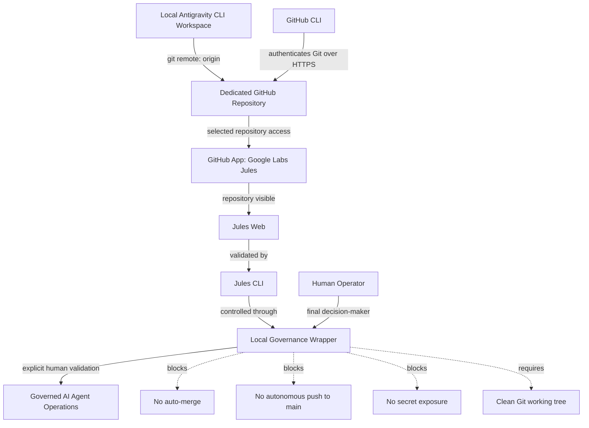

# Project Tesla Field Note — MVP

## Integrating Google Jules with Antigravity CLI on Ubuntu

**From misleading login success to a governed GitHub-backed AI agent workflow**

**Author:** Abdellah MOUHTAJ  
**Title:** Ops Consultant — AI Agents, CLI Workflows & Local Governance

> Testing, stabilizing, and documenting real-world AI agent integrations: bridging the gap between experimental tools and secure, governed developer workflows.

---

## Status

**MVP field documentation — sanitized public version.**

---

## Tested Environment

| Item | Value |
|---|---|
| Field validation date | 2026-05-27 |
| Machine | Ubuntu workstation |
| OS | Ubuntu 24.04.4 LTS |
| Local workspace | Antigravity CLI project, codename `Tesla` |
| Local project root | `/home/[USERNAME]/antigravity-workspace` |
| GitHub repository | Dedicated private repository |
| Jules CLI version observed | `v0.1.42` |
| GitHub CLI version observed | `gh 2.45.0` |

---

## Important Security Notice

This document is a **sanitized field note**.

It intentionally omits:

- OAuth callback links
- one-time authorization codes
- tokens
- private credentials
- raw logs
- secret files
- personal local paths that are not required to reproduce the integration pattern

---

## 1. Executive Summary

This field note documents a real-world integration between **Google Jules**, **GitHub**, **GitHub CLI**, and a local **Antigravity CLI** workspace on Ubuntu.

The objective looked simple at first:

- make Jules Web see a dedicated GitHub repository;
- make Jules CLI see that same repository;
- attach the local Antigravity CLI workspace to the GitHub repository;
- preserve local operational governance;
- avoid uncontrolled AI agent execution;
- avoid exposing secrets;
- avoid launching any Jules task before the infrastructure was validated.

In practice, the operation was not trivial.

The main trap was a misleading authentication signal:

```bash
jules login
```

Result:

```text
You are now logged in
```

But the operational command failed:

```bash
jules remote list --repo
```

Result:

```text
401 UNAUTHENTICATED
```

The key lesson:

> A successful CLI login message is not enough.

For this integration, each layer had to be validated independently:

1. Jules Web authentication.
2. Correct Google account.
3. GitHub App authorization.
4. Explicit repository access in the GitHub App.
5. Repository visibility in Jules Web.
6. Repository visibility in Jules CLI.
7. Local Git remote configuration.
8. GitHub CLI authentication for Git over HTTPS.
9. Local governance wrapper behavior.
10. Git working tree cleanliness using Git porcelain, not branch status output.

Final MVP result:

- Jules Web could see the dedicated GitHub repository.
- Jules CLI could list the repository.
- The local Antigravity workspace was connected to GitHub.
- GitHub CLI authenticated Git operations.
- The local repository was pushed to GitHub.
- A governed wrapper controlled Jules-related operations.
- A false-positive Git cleanliness guard was fixed.
- No Jules mission was launched.
- No API key was created.
- No secrets were published.
- No autonomous merge or push to `main` was allowed.

---

## 2. Problem Statement

The integration failed in a misleading way.

The CLI login appeared successful:

```bash
jules login
```

However, the operational validation command failed:

```bash
jules remote list --repo
```

The result was:

```text
401 UNAUTHENTICATED
```

This created a diagnostic ambiguity.

At first glance, possible causes included:

- broken browser callback;
- broken local keyring;
- missing local Git remote;
- wrong GitHub authentication;
- wrong Google account;
- missing GitHub App authorization;
- missing repository permission;
- unstable or incomplete CLI authentication state.

The real problem was **not solved by repeating login attempts**.

The breakthrough came from separating the integration into multiple independent layers.

---

## 3. Core Insight

The successful solution was to stop treating **Jules authentication** as one single thing.

The integration actually involved several distinct surfaces.

### A. Jules Web

The browser-based Jules environment must be accessible with the correct Google account.

### B. GitHub App Authorization

Google Labs Jules must be authorized through GitHub, ideally with access only to the selected repository.

### C. Repository Visibility

The target repository must appear inside Jules Web before expecting Jules CLI to operate correctly.

### D. Jules CLI

The CLI must be tested with an operational command, not just with login.

### E. Local Git

The local Antigravity workspace must have a valid Git remote pointing to GitHub.

### F. GitHub CLI

Git operations over HTTPS must be authenticated separately.

Jules CLI authentication does not automatically authenticate local Git push/fetch operations.

### G. Local Governance Wrapper

Operational commands must be guarded locally to prevent:

- unsafe agent behavior;
- dirty working tree operations;
- accidental secret exposure;
- uncontrolled remote tasks.

### H. Git Cleanliness Logic

A wrapper should use:

```bash
git status --porcelain --untracked-files=all
```

to determine if the working tree is clean.

It should **not** use:

```bash
git status --short --branch --untracked-files=all
```

as the cleanliness condition, because branch tracking lines such as:

```text
## main...origin/main
```

are not file changes.

---

## 4. Target Architecture

The MVP integration architecture is:



Supporting component:

> GitHub CLI authenticates Git over HTTPS and configures Git credentials.

Governance rule:

> Jules is treated as a delegated remote agent, not as the local authority.

The local workspace remains the operational source of truth.  
Human validation remains mandatory before any major remote action.

---

## 5. MVP Prerequisites

Before attempting the integration, the following must be true:

1. A local Git repository already exists.
2. The local working tree is clean.
3. A dedicated GitHub repository exists or will be created.
4. The GitHub repository should initially be empty if the local repository already has history.
5. GitHub CLI is available or can be installed.
6. Jules CLI is available.
7. The correct Google account is known.
8. The correct GitHub account is known.
9. No secrets, tokens, `.env` files, private credentials, or personal data should be exposed.
10. No Jules task should be launched during infrastructure validation.

Recommended repository setup:

- private repository for first integration;
- no initial README;
- no initial `.gitignore`;
- no initial license.

Reason:

If the local Git repository already has history, creating a GitHub repository with initial files can create unnecessary first-push conflicts.

---

## 6. Step-by-Step MVP Solution

### Step 1 — Validate the Local Workspace State

Purpose:

> Ensure the local project is stable before connecting it to a remote service.

Conceptual checks:

- confirm current directory is the expected project root;
- confirm Git is initialized;
- confirm branch is `main`;
- confirm working tree is clean;
- confirm no secret files are staged;
- confirm no private operational folders are intended for publication.

Example workspace placeholder:

```bash
cd /home/[USERNAME]/antigravity-workspace
```

Useful checks:

```bash
git status --short --branch --untracked-files=all
git log --oneline -5
git remote -v
```

Expected state before remote setup:

- Git repository exists.
- Branch is `main`.
- Working tree is clean.
- No unexpected files are staged.
- Either no remote exists yet, or the remote is intentionally configured.

---

### Step 2 — Create a Dedicated GitHub Repository

Purpose:

> Give Jules a specific repository to access.

Recommended settings:

- visibility: private at first;
- no README;
- no `.gitignore`;
- no license;
- repository dedicated to the integration.

Reason:

A dedicated repository reduces noise, minimizes accidental exposure, and makes GitHub App authorization more precise.

Important:

> Do not push yet if GitHub authentication for Git is not ready.

---

### Step 3 — Authorize Google Labs Jules through GitHub

Purpose:

> Allow Jules to access the dedicated GitHub repository.

Recommended GitHub App permission model:

- choose **Only select repositories**;
- select only the dedicated integration repository;
- save the authorization.

Why this matters:

Using **All repositories** may be convenient, but it is not the safest default.

A field-tested integration should start with least privilege.

---

### Step 4 — Validate Repository Visibility in Jules Web

Purpose:

> Confirm that the GitHub App authorization is effective.

Open Jules Web with the correct Google account.

Expected result:

> The dedicated GitHub repository appears in the Jules Web repository list.

If the repository does not appear:

- verify the Google account;
- verify the GitHub account;
- verify GitHub App installation;
- verify selected repository permissions;
- verify whether the repository is owned by the expected account or organization;
- avoid debugging Jules CLI before Jules Web sees the repository.

Key lesson:

> Jules Web visibility is an important checkpoint before trusting Jules CLI.

---

### Step 5 — Validate Jules CLI with an Operational Command

Purpose:

> Do not trust login alone. Test repository visibility from CLI.

Run:

```bash
jules remote list --repo
```

Expected result:

> The dedicated GitHub repository is listed.

Failure mode:

If:

```bash
jules login
```

says success, but:

```bash
jules remote list --repo
```

returns:

```text
401 UNAUTHENTICATED
```

then the CLI is not operationally ready, even if login appears successful.

Do not proceed to missions.

Recommended diagnostic order:

1. Recheck Jules Web.
2. Recheck GitHub App repository authorization.
3. Recheck Google account.
4. Recheck GitHub account.
5. Confirm the repository is visible in Jules Web.
6. Retry the CLI repository listing.

Field conclusion:

> The 401 issue was resolved when the GitHub App and repository visibility path was properly validated.

---

### Step 6 — Add the GitHub Remote to the Local Repository

Purpose:

> Connect the local Antigravity workspace to the dedicated GitHub repository.

Conceptual command:

```bash
git remote add origin https://github.com/OWNER/REPOSITORY.git
```

Then verify:

```bash
git remote -v
```

Expected result:

> `origin` is configured for fetch and push.

Important:

> Adding the remote does not prove Git authentication works.

You must still validate GitHub HTTPS authentication separately.

---

### Step 7 — Test Git Remote Access Read-Only

Purpose:

> Check whether local Git can access the remote repository.

Run:

```bash
git ls-remote --symref origin HEAD
```

Possible result before GitHub CLI authentication:

```text
fatal: could not read Username for 'https://github.com': terminal prompts disabled
```

Interpretation:

The remote URL may be correct, but local Git does not yet have valid HTTPS credentials.

This is not a Jules CLI problem.  
This is a local Git/GitHub authentication problem.

---

### Step 8 — Authenticate GitHub CLI

Purpose:

> Use GitHub CLI to authenticate Git operations over HTTPS without manually managing tokens.

Recommended command pattern:

```bash
gh auth login --hostname github.com --git-protocol https --web --scopes repo
```

Then configure Git to use GitHub CLI as credential helper:

```bash
gh auth setup-git --hostname github.com
```

Then verify:

```bash
gh auth status
```

Then retry:

```bash
git ls-remote --symref origin HEAD
```

Possible interpretation:

If the repository is private but still empty, the command may return no branch information yet.

The important part is that the previous username/password prompt error is gone.

---

### Step 9 — Push the Local Main Branch to GitHub

Purpose:

> Publish the local repository history to the dedicated GitHub repository.

Command:

```bash
git push -u origin main
```

Expected result:

- remote branch `main` is created;
- upstream tracking is configured;
- local `main` tracks `origin/main`.

Verify:

```bash
git status --short --branch --untracked-files=all
git ls-remote --heads origin main
git rev-parse HEAD
```

Expected final relationship:

> Local HEAD equals remote `main` HEAD.

This validates that local Git, GitHub CLI, and the GitHub repository are correctly connected.

---

### Step 10 — Add a Governed Local Wrapper

Purpose:

> Prevent unsafe Jules operations and make the workflow repeatable.

The wrapper should enforce:

- correct project root;
- clean Git working tree for operational actions;
- explicit commands only;
- no default login execution without validation;
- no automatic mission start;
- no automatic merge;
- no automatic push to `main` by Jules;
- no exposure of secrets;
- no access to private local folders;
- clear status output.

Example command structure:

```bash
tesla-jules status
tesla-jules repos
tesla-jules sessions
tesla-jules mission
tesla-jules pull
tesla-jules login
```

Recommended behavior:

| Command | Recommended behavior |
|---|---|
| `status` | Allowed, read-only |
| `repos` | Allowed if Git guard passes |
| `sessions` | Allowed if Git guard passes |
| `mission` | Blocked or requires explicit validation |
| `pull` | Controlled |
| `login` | Blocked by default or requires explicit validation |

The wrapper is not just convenience tooling.

> It is the local governance boundary between the developer, the AI agent, GitHub, and the local workspace.

---

### Step 11 — Fix the Git Cleanliness Guard

Problem encountered:

After the first successful push, Git status displayed:

```text
## main...origin/main
```

The wrapper incorrectly interpreted this as a dirty working tree and blocked operations with:

```text
BLOCKED_GIT_NOT_CLEAN=1
```

Root cause:

The wrapper used:

```bash
git status --short --branch --untracked-files=all
```

as the cleanliness condition.

But this output includes branch tracking information.

Branch tracking information is not a file modification.

Correct approach:

Use this for human-readable display:

```bash
git status --short --branch --untracked-files=all
```

Use this for actual cleanliness logic:

```bash
git status --porcelain --untracked-files=all
```

Correct logic:

```bash
STATUS="$(git status --short --branch --untracked-files=all)"
PORCELAIN="$(git status --porcelain --untracked-files=all)"

printf '%s\n' "$STATUS"

if [ -n "$PORCELAIN" ]; then
  echo "BLOCKED_GIT_NOT_CLEAN=1"
  echo "REASON=Operational Jules actions require a clean working tree."
  return 1
fi
```

Key lesson:

> For scripting, Git porcelain is the correct interface for machine-readable working tree state.

---

### Step 12 — Recheck Jules after the Wrapper Fix

Run:

```bash
tesla-jules repos
```

Expected result:

> The dedicated GitHub repository is listed.

This confirms:

- Jules Web sees the repository;
- Jules CLI sees the repository;
- the wrapper does not block on a false Git status signal;
- Git tracking state is handled correctly;
- the local governance layer is operational.

---

## 7. Troubleshooting Matrix

| Issue | Likely cause | Fix |
|---|---|---|
| `jules login` says success, but `jules remote list --repo` returns `401 UNAUTHENTICATED` | Jules CLI is not operationally connected to the expected repository, or GitHub App authorization/repository visibility is incomplete | Validate Jules Web first. Confirm GitHub App is installed and explicitly authorized for the repository. Confirm the repository appears in Jules Web. Then retry the CLI command |
| Repository appears in GitHub but not in Jules Web | GitHub App authorization is missing or does not include the repository | Open GitHub App settings for Google Labs Jules. Choose selected repositories. Add the dedicated repository. Save. Recheck Jules Web |
| Jules CLI can see the repository, but `git ls-remote` fails with username/password error | Jules CLI auth is separate from local Git HTTPS auth | Authenticate GitHub CLI and configure Git with `gh auth setup-git` |
| `git ls-remote` returns no branch information after auth | The remote repository may still be empty | If authentication errors are gone and the repository was intentionally created empty, proceed with the first controlled push |
| Wrapper blocks with `BLOCKED_GIT_NOT_CLEAN=1` even when no files are modified | The wrapper is using branch status output as a cleanliness condition | Use `git status --porcelain --untracked-files=all` for logic. Keep `git status --short --branch` only for display |
| The local repository has no remote | The GitHub repository exists, but the local workspace has not been attached to it | Add origin with `git remote add origin https://github.com/OWNER/REPOSITORY.git` |
| A Jules mission is tempting to launch immediately after repository visibility succeeds | Infrastructure may not yet be governed, Git may not be synchronized, and safety rules may not be in place | Do not launch missions until final postchecks are green |

---

## 8. Security Model

This integration must be treated as a security-sensitive workflow.

The following items must never be published:

- OAuth callback links
- one-time authorization codes
- access tokens
- API keys
- client secrets
- `.env` files
- `.pem` files
- private credentials
- raw authentication logs
- browser callback links
- unredacted screenshots
- private local paths if not necessary
- personal folders
- cache folders
- agent internal state files
- unreviewed generated outputs

Recommended public documentation rule:

> Publish the process, not the secrets.

Recommended repository authorization rule:

> Grant Jules access only to the repositories it needs.

Recommended agent governance rule:

- no autonomous push to `main`;
- no auto-merge;
- no mission without explicit validation;
- no secret-bearing files in agent context;
- no uncontrolled access to local private folders.

Recommended operational rule:

> Jules is a delegated remote agent.  
> The local governed workspace remains the authority.  
> The human operator remains the final validator.

---

## 9. Final MVP Acceptance Criteria

The integration is considered MVP-ready only when all the following are true:

- [x] The dedicated GitHub repository exists.
- [x] The repository is visible in Jules Web.
- [x] `jules remote list --repo` lists the repository.
- [x] The local Git repository has `origin` configured.
- [x] GitHub CLI is authenticated.
- [x] Git is configured to use GitHub CLI as credential helper.
- [x] `git push -u origin main` succeeds.
- [x] Local HEAD equals remote `main` HEAD.
- [x] The local wrapper can run its repository listing command.
- [x] The wrapper uses Git porcelain for cleanliness checks.
- [x] No Jules mission has been launched during infrastructure validation.
- [x] No API key has been created unnecessarily.
- [x] No secrets have been exposed.
- [x] No autonomous merge or push-to-main is enabled.
- [x] The working tree is clean after the operation.

Final validated state from the field operation:

```text
JULES_AUTH_RESOLVED=1
GITHUB_APP_REPO_VISIBLE=1
JULES_CLI_REPOS_OK=1
GITHUB_REMOTE_OK=1
GITHUB_AUTH_OK=1
LOCAL_REMOTE_HEAD_MATCH=1
GIT_FINAL_CLEAN_SYNCED=1
TESLA_JULES_WRAPPER_OK=1
MISSION_JULES_NOT_STARTED=1
```

---

## 10. Why This Matters

This integration is not just a tutorial.

It is a practical example of operationalizing emerging AI developer tools.

The main value is not:

> “I connected a tool.”

The value is:

- identifying a misleading success state;
- separating authentication layers;
- validating Web, CLI, GitHub App, GitHub CLI, and local Git independently;
- enforcing local governance before allowing AI agent operations;
- documenting failed hypotheses;
- creating a reproducible runbook for others.

The broader lesson:

> AI coding agents are not only about prompting.

They require:

- infrastructure;
- authentication;
- repository mapping;
- local safety boundaries;
- Git discipline;
- human-controlled governance.

---

## 11. Failed Hypotheses Worth Documenting

### Hypothesis 1 — The local secret service or keyring was broken

**Result:** Not the primary cause.

**Lesson:** Do not immediately blame the keyring when Jules CLI returns `401`. First validate GitHub App authorization and repository visibility in Jules Web.

---

### Hypothesis 2 — The browser login callback was broken

**Result:** Not sufficient to explain the failure.

**Lesson:** Manual login and browser login can both show success while operational repository listing still fails.

---

### Hypothesis 3 — The missing local Git remote caused the Jules CLI 401

**Result:** The missing remote was a real future blocker, but not the direct explanation for the initial Jules remote API `401`.

**Lesson:** Separate Jules cloud-side repository visibility from local Git remote configuration.

---

### Hypothesis 4 — The wrapper correctly detected a dirty Git tree

**Result:** False.

**Lesson:** Branch tracking output is not a dirty working tree. Use Git porcelain for script logic.

---

## 12. Minimal Command Reference

> Warning: commands below are conceptual. Replace placeholders before use. Do not paste commands containing secrets into public documentation.

Move to a sanitized local workspace path:

```bash
cd /home/[USERNAME]/antigravity-workspace
```

Check Git state:

```bash
git status --short --branch --untracked-files=all
```

Check machine-readable cleanliness:

```bash
git status --porcelain --untracked-files=all
```

List Git remotes:

```bash
git remote -v
```

Add GitHub remote:

```bash
git remote add origin https://github.com/OWNER/REPOSITORY.git
```

Check remote access:

```bash
git ls-remote --symref origin HEAD
```

Authenticate GitHub CLI:

```bash
gh auth login --hostname github.com --git-protocol https --web --scopes repo
```

Configure Git credentials through GitHub CLI:

```bash
gh auth setup-git --hostname github.com
```

Check GitHub CLI auth:

```bash
gh auth status
```

Push `main`:

```bash
git push -u origin main
```

Check remote branch:

```bash
git ls-remote --heads origin main
```

Check local HEAD:

```bash
git rev-parse HEAD
```

Check Jules repositories:

```bash
jules remote list --repo
```

Check governed wrapper:

```bash
tesla-jules repos
```

---

## 13. Public-Facing Summary

I integrated Google Jules with a local Antigravity CLI workspace on Ubuntu and documented the real failure path.

The interesting part was not installation.

The interesting part was a misleading authentication success:

> `jules login` reported success, but the operational command returned `401 UNAUTHENTICATED`.

The solution was to split the system into layers:

- Jules Web;
- GitHub App repository access;
- Jules CLI repository visibility;
- local Git remote;
- GitHub CLI authentication;
- governed local wrapper;
- Git porcelain-based safety checks.

The result was a secure, reproducible, governed workflow where Jules can see the repository, Git is properly authenticated, the local workspace remains authoritative, and no AI mission is launched without explicit validation.

---

## 14. Final Lessons Learned

1. Never trust a login success message alone.  
   Always validate with an operational command.

2. Jules Web visibility matters.  
   If the repository does not appear in Jules Web, do not waste time debugging local Git.

3. Jules CLI authentication is not Git authentication.  
   GitHub CLI may still be required for local push/fetch operations.

4. GitHub App permissions are part of the integration.  
   Repository access must be explicitly granted.

5. Empty GitHub repositories are useful when pushing an existing local history.  
   They reduce first-push conflicts.

6. Use least privilege.  
   Authorize only the required repository.

7. Use Git porcelain in scripts.  
   Do not parse branch status output as a working tree cleanliness signal.

8. Local governance matters.  
   Wrappers, guardrails, and human validation turn experimental tools into professional workflows.

9. Document failed hypotheses.  
   They are often more valuable than the final command sequence.

10. Do not launch agent missions before the infrastructure is stable.  
    First stabilize. Then delegate.

---

## 15. MVP Conclusion

This MVP integration proves that Google Jules, GitHub, GitHub CLI, and an Antigravity CLI workspace can be connected into a governed developer workflow on Ubuntu.

The final architecture is not just functional.

It is controlled.

Jules can access the repository.  
GitHub can receive the local code.  
GitHub CLI can authenticate Git operations.  
The wrapper can enforce local rules.  
The human operator remains the final decision-maker.

That is the core principle:

> Precision in the workflow.  
> Governance in the process.  
> Stability in the result.

---

## 16. Call to Action

Facing similar integration challenges with AI Agents in your local workflows?

**Let’s build the runbooks together.**

I am documenting the silent failures of emerging AI tools to create a reliable knowledge base for the community.

If you have encountered similar issues, found a hidden failure mode, or developed a stabilization pattern worth sharing, I would be glad to hear from you.

Connect with me:

- GitHub: <https://github.com/Abdel-MOUHTAJ>
- Reddit: <https://www.reddit.com/user/Abdel-The-Mage/>
- LinkedIn: <https://www.linkedin.com/in/abdellah-mouhtaj-communication-softskills/>

---

## 17. Sanitization Check

This MVP public version has been reviewed to avoid exposing:

- personal home paths;
- private local project paths;
- OAuth callback links;
- one-time authorization codes;
- tokens;
- API keys;
- raw logs;
- private credential files;
- unredacted screenshots;
- private cache/state directories.

All example local paths use placeholders such as:

```text
/home/[USERNAME]/antigravity-workspace
```

All GitHub commands use placeholders such as:

```text
https://github.com/OWNER/REPOSITORY.git
```

No private local path is required to understand or reproduce the integration model.
