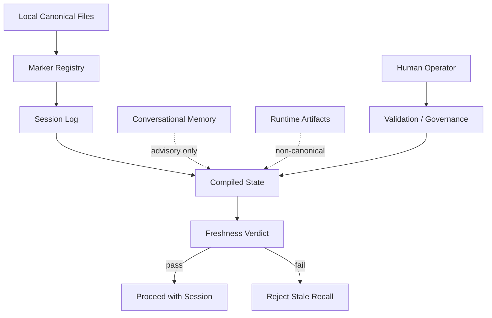

# Project Tesla Field Note — MVP

## GOVERNOR MEMORY: Freshness-Aware Session Reprise for Codex

**From stale recall to governed local memory**

**Author:** Abdellah MOUHTAJ  
**Title:** Ops Consultant — AI Agents, CLI Workflows & Local Governance

> Testing, stabilizing, and documenting real-world AI agent integrations: bridging the gap between experimental tools and secure, governed developer workflows.

---

## Status

**MVP field documentation — sanitized public version.**

---

## Tested Environment

| Item | Value |
|---|---|
| Validation date | 2026-06-01 |
| Machine | Windows workstation |
| Local workspace | Codex governed workspace |
| Publication target | `ai-agent-field-notes` |
| Source theme | Freshness-aware session reprise and local memory governance |
| Validation context | Local compiled state + marker governance + session replay control |

---

## Important Security Notice

This document is a **sanitized public field note**.

It intentionally omits:

- private local paths
- tokens
- raw logs
- secret files
- unreviewed runtime artifacts
- internal session URLs
- private state files

---

## 1. Executive Summary

This field note documents a governed memory loop for Codex.

The problem looked small at first:

> How do you keep session reprise fresh when local files change faster than conversational memory?

In practice, the issue is not just memory. It is governance.

If session start relies on stale recall, the workflow can surface obsolete assumptions, lose track of the latest marker state, and create contradictions between runtime memory and local canonical files.

The MVP solution is:

1. compile the current governed state;
2. read the marker registry;
3. compare against the freshest local sources;
4. reject contradictions explicitly;
5. proceed only if the freshness verdict is acceptable.

Final MVP result:

- the session start contract became freshness-aware;
- the marker registry became part of the operating model;
- compiled state became the canonical resume layer;
- stale conversational memory stopped being treated as authoritative;
- local files became the primary source of truth.

The key lesson:

> A memory system is not useful because it remembers more. It is useful because it remembers under governance.

---

## 2. Problem Statement

The session reprise problem is subtle.

The workspace can already contain fresher truth than the assistant’s current memory.

That creates several failure modes:

- stale recall at session start;
- silent contradictions between sources;
- overconfidence in prior context;
- uncertainty about which file is canonical;
- runtime artifacts being mistaken for durable state;
- poor recovery when the current session resumes after a gap.

This is not a theoretical issue.

It is a practical operational one:

> If the assistant starts from the wrong state, every later decision inherits the error.

The memory layer must therefore be treated as a governed system, not a casual summary.

---

## 3. Core Insight

The successful solution was to stop treating memory as a single block.

The actual operating model contains several distinct surfaces:

### A. Local Canonical Files

These are the governed sources that define the current workspace truth.

### B. Marker Registry

The textual markers define session intent, control signals, and the active workflow vocabulary.

### C. Compiled State

The compiled snapshot makes freshness explicit instead of implied.

### D. Session Log

The session log records what actually happened during the latest run.

### E. Conversational Memory

Conversation memory is useful, but it is not the authority.

### F. Runtime Artifacts

Runtime artifacts are temporary. They should not be promoted automatically.

The key decision:

> Local files outrank stale conversation context.

That is the core of GOVERNOR MEMORY.

---

## 4. Target Architecture

The MVP memory architecture is:



Governance rule:

> The compiled state is a checkpoint, not a source of self-authorizing truth.

The local workspace remains the operational source of truth.

Human validation remains mandatory when a durable state change is involved.

---

## 5. MVP Prerequisites

Before the workflow can be trusted, the following must be true:

1. A canonical local workspace exists.
2. The governance files are present.
3. The marker registry is readable.
4. The session log exists.
5. The compiled state can be produced.
6. Stale context is not treated as authoritative.
7. Runtime artifacts remain non-canonical.
8. Contradictions are rejected explicitly.
9. The operator can inspect the freshness verdict.
10. The workflow remains local-first.

Recommended policy:

- keep durable memory in Markdown;
- keep runtime outputs separate from canonical notes;
- prefer explicit freshness checks over informal recall;
- avoid silent promotion of temporary state.

---

## 6. Step-by-Step MVP Solution

### Step 1 - Read the Canonical Governance Files

Purpose:

> Establish local authority before any resume logic is trusted.

Core files:

- workspace bootstrap contract;
- memory governance rules;
- marker registry;
- latest session log;
- compiled state snapshot.

The important point is not that the files exist.

The point is that they are read in order and treated as the current authority stack.

---

### Step 2 - Compile the Current State

Purpose:

> Convert dispersed local truth into a single governed snapshot.

The compiled state should answer:

- what is the current freshness verdict;
- what files were read;
- what markers are active;
- what risks remain open;
- what the next action is.

The compilation step prevents the assistant from improvising a memory answer from stale context.

---

### Step 3 - Compare Against the Freshest Source

Purpose:

> Make contradiction visible instead of implicit.

The freshest source can be:

- the latest session log;
- the latest save state;
- the most recent marker update;
- the most recent audit snapshot.

If the compiled state disagrees with the freshest source, the contradiction must be explicit.

Do not silently choose the convenient version.

---

### Step 4 - Reject Stale Recall Explicitly

Purpose:

> Stop the session from proceeding on obsolete assumptions.

The correct behavior is not:

- “I think it probably means X.”

The correct behavior is:

- “The current source set does not support that claim.”

This is the operational boundary between memory and governance.

---

### Step 5 - Proceed Only If the Verdict Is Acceptable

Purpose:

> Prevent the wrong memory state from becoming the basis for the next action.

If the freshness verdict is acceptable, the workflow proceeds.

If not, the workflow stops and asks for revalidation.

That is the whole point of the compile loop:

> the assistant can move fast only after it has proven it is aligned.

---

## 7. Troubleshooting Matrix

| Issue | Likely cause | Fix |
|---|---|---|
| The assistant answers from stale memory | The workspace truth was not re-read before answering | Re-run the canonical read order and compile the current state |
| The compiled state disagrees with the session log | The latest source changed after the previous snapshot | Recompile and use the newer source as authoritative |
| Runtime artifacts look important but are not canonical | Temporary files are being overvalued | Keep runtime artifacts separate from durable governance files |
| Contradictions appear silently | The workflow is too permissive | Force explicit contradiction handling |
| Session reprise feels vague | The memory layer lacks a freshness gate | Make freshness a first-class output |
| The next action is unclear | The compiled snapshot is incomplete | Include next action and open risks in the state snapshot |

---

## 8. Security Model

This workflow must be treated as governance-sensitive.

The following items must never be promoted automatically:

- private paths
- tokens
- secrets
- raw logs
- unreviewed state dumps
- authentication artifacts
- internal session URLs
- any runtime-only artifact that has not been validated

Recommended public documentation rule:

> Publish the pattern, not the private machinery.

Recommended operational rule:

> Local files outrank stale conversational memory.

Recommended governance rule:

> Contradictions must be explicit, never silent.

---

## 9. Final MVP Acceptance Criteria

The workflow is considered MVP-ready only when all of the following are true:

- [x] the canonical local files are readable
- [x] the marker registry is explicit
- [x] the session log is part of the decision flow
- [x] the state is compiled before reuse
- [x] stale recall is rejected when it conflicts with local truth
- [x] runtime artifacts remain non-canonical
- [x] the freshness verdict is visible
- [x] the next action is clear
- [x] contradictions are surfaced, not hidden

Final validated state:

```text
GOVERNOR_MEMORY_COMPILED=1
FRESHNESS_GATE_ACTIVE=1
STALE_CONTEXT_REJECTED=1
CONTRADICTION_HANDLING_EXPLICIT=1
LOCAL_CANONICAL_FILES_ARE_AUTHORITATIVE=1
```

---

## 10. Why This Matters

This MVP is not a note about memory.

It is a note about operational reliability.

The main value is not:

> “The assistant remembered something.”

The value is:

- the assistant resumed from governed local truth;
- the assistant rejected stale context explicitly;
- the assistant preserved authority boundaries;
- the assistant surfaced the next action cleanly;
- the assistant remained local-first and auditable.

The broader lesson:

> In governed workflows, memory is a system of authority, not just a convenience feature.

---

## 11. Failed Hypotheses Worth Documenting

### Hypothesis 1 - Conversation memory is enough

**Result:** False.

**Lesson:** Conversation memory is useful, but it cannot outrank fresher local files.

---

### Hypothesis 2 - A compiled state can be trusted without re-reading sources

**Result:** False.

**Lesson:** A state snapshot is only valid if it is compiled from fresh local sources.

---

### Hypothesis 3 - Runtime artifacts can be promoted automatically

**Result:** False.

**Lesson:** Temporary outputs should remain temporary until validated.

---

### Hypothesis 4 - Contradictions can be handled silently

**Result:** False.

**Lesson:** Silent contradiction handling is a governance failure.

---

## 12. Minimal Command Reference

> Warning: commands below are conceptual and sanitized.

Re-read the governing sources:

```text
read canonical files
compile current state
inspect marker registry
inspect latest session log
compare against freshest source
reject contradictions explicitly
```

The important part is the sequence, not a specific tool invocation.

For this MVP, the operational rule is:

> Read, compile, compare, reject, proceed.

---

## 13. Public-Facing Summary

I built and validated a local memory governance loop for Codex.

The issue was not the absence of memory.

The issue was the absence of freshness discipline.

The solution was to make local truth authoritative, compile state before reuse, and reject stale recall explicitly.

That produces a better operational result than a conversational summary:

- clearer session reprise;
- explicit contradiction handling;
- stable marker governance;
- a cleaner next action;
- a more reliable assistant.

---

## 14. Final Lessons Learned

1. Memory without governance becomes stale confidence.
2. Local files must outrank stale conversation context.
3. Compiled state is useful only when freshness is explicit.
4. Runtime artifacts are not canonical by default.
5. Contradictions should be surfaced, not guessed away.
6. The assistant should proceed only after the verdict is acceptable.
7. A good memory system is a decision-quality system.

---

## 15. MVP Conclusion

This MVP proves that Codex can resume from governed local memory rather than from stale conversational residue.

The final architecture is not just functional.

It is controlled.

The canonical files define the truth.  
The compiled state defines the freshness.  
The human operator defines the validation boundary.  
The assistant uses memory, but does not worship it.

That is the core principle:

> Precision in the workflow. Governance in the process. Stability in the result.

---

## 16. Call to Action

Facing similar problems with stale context, weak resume logic, or uncontrolled memory drift in AI workflows?

Let’s build the runbooks together.

If you have a local memory governance pattern, a compile-loop design, or a contradiction-handling rule worth sharing, I would be glad to compare notes.

---

## 17. Sanitization Check

This MVP public version has been reviewed to avoid exposing:

- private local paths
- tokens
- raw logs
- secret files
- internal session URLs
- unreviewed runtime artifacts
- any unnecessary operational detail

No private local path is required to understand or reproduce the governance pattern.
