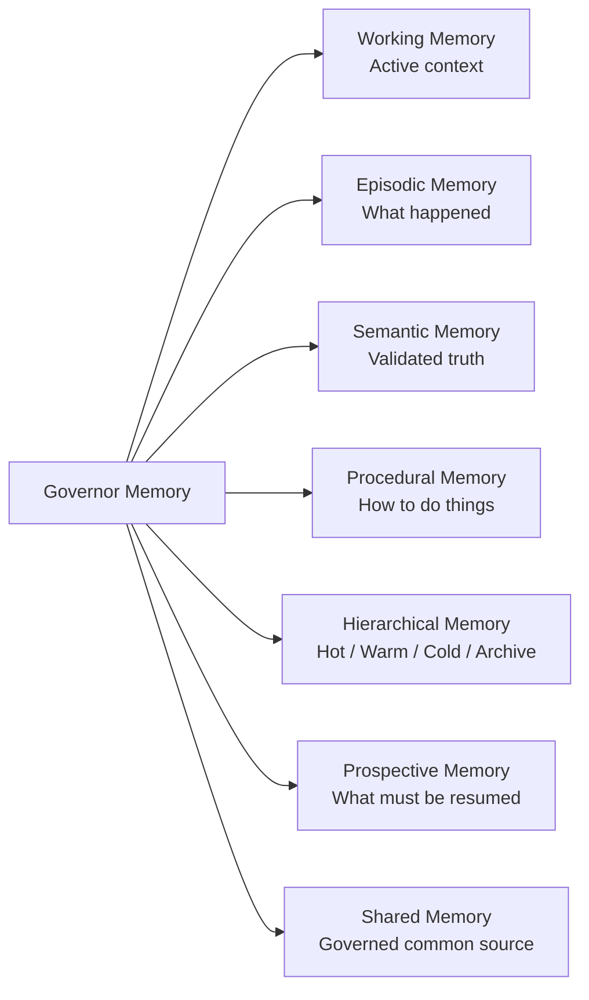
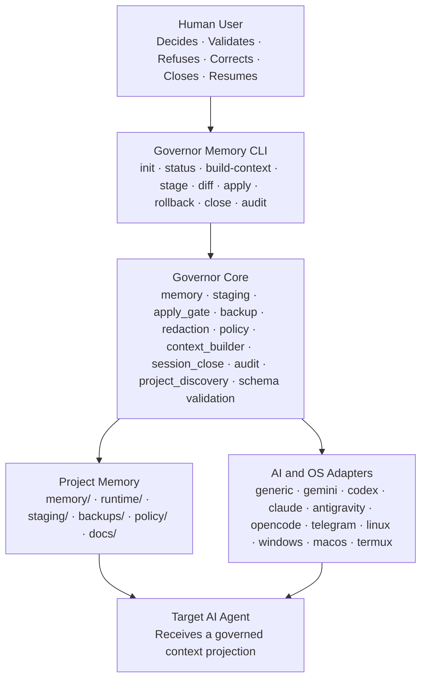
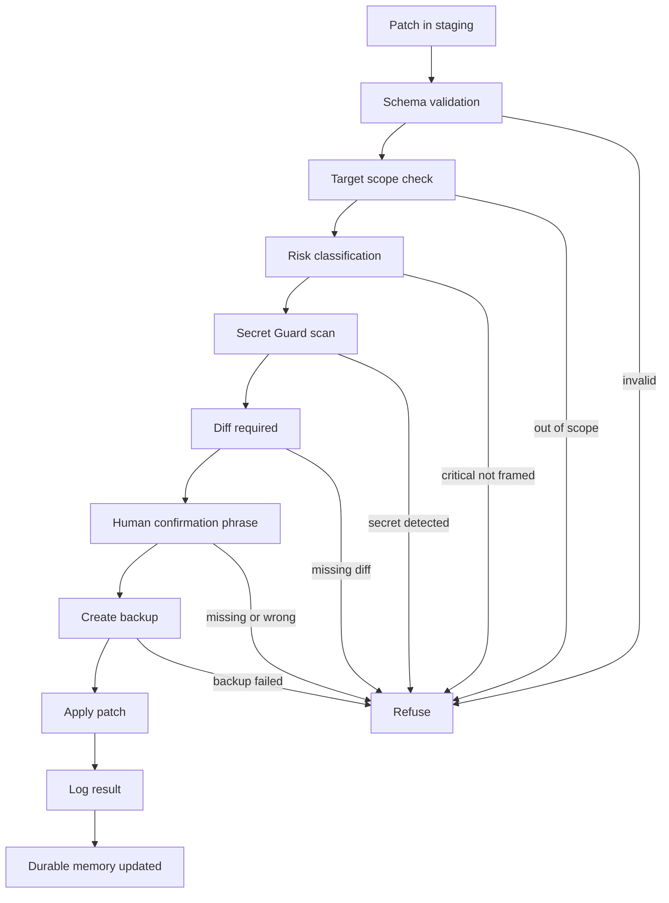
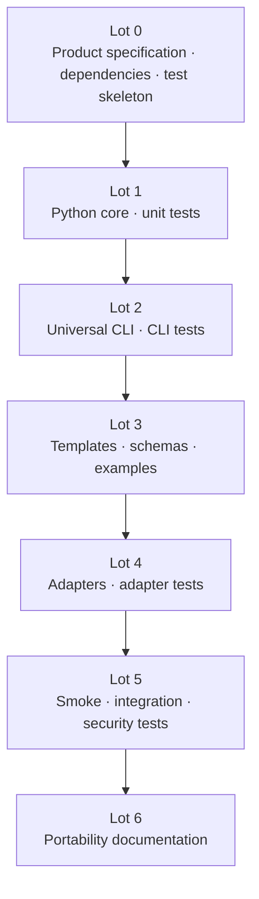

# Governor Memory

> **Universal field-tested governed memory for AI agents.**
>
> Persistent memory is powerful. Ungoverned persistent memory is dangerous. Governor Memory gives AI agents durable context without giving them uncontrolled authority over canonical memory.

[](#mvp-status)
[](#architecture)
[](#memory-model)
[](#security-model)
[](#technical-stack)

---

## Table of Contents

- [Executive Summary](#executive-summary)
- [Positioning](#positioning)
- [The Real Problem](#the-real-problem)
- [Product Promise](#product-promise)
- [Core Doctrine](#core-doctrine)
- [Memory Model](#memory-model)
- [Architecture](#architecture)
- [Repository Layout](#repository-layout)
- [Governed Project Layout](#governed-project-layout)
- [CLI Surface](#cli-surface)
- [Apply Gate](#apply-gate)
- [Security Model](#security-model)
- [Context Builder](#context-builder)
- [Adapter System](#adapter-system)
- [Configuration](#configuration)
- [Patch Model](#patch-model)
- [Audit Contract](#audit-contract)
- [Testing Strategy](#testing-strategy)
- [MVP Roadmap](#mvp-roadmap)
- [Acceptance Criteria](#acceptance-criteria)
- [GitHub Repository Standards](#github-repository-standards)
- [Post-MVP Extensions](#post-mvp-extensions)
- [Final Verdict](#final-verdict)

---

## Executive Summary

Governor Memory is an independent governed-memory layer for AI agents.

It solves a simple-looking but operationally difficult problem:

> Enable an AI agent to retain durable, reusable memory across sessions without allowing it to freely mutate canonical memory.

Governor Memory is not a theoretical memory sketch. It is the product of field work: testing, implementing, auditing, correcting, documenting, securing, optimizing, and repeating until a reliable doctrine for persistent AI-agent memory emerged.

The product was forged in real hybrid environments where multiple agents, tools, operating systems, wrappers, execution modes, documentation practices, and long-running sessions had to preserve continuity without losing control.

Governor Memory is:

- **agent-agnostic** — it can support different AI agents and execution models;
- **environment-agnostic** — it can operate across Linux, macOS, Windows, and constrained environments such as Termux;
- **Markdown-first** — canonical memory remains human-readable, diffable, auditable, and portable;
- **Python-first** — the MVP implementation favors cross-platform reliability;
- **schema-validated** — structured memory patches are validated before application;
- **human-governed** — durable writes require explicit human validation;
- **rollback-ready** — every durable write is backed up before application;
- **secret-aware** — potential secrets are masked and blocked from promotion into cold memory;
- **adapter-based** — agent-specific integrations remain outside the universal core.

The signature idea is clear:

> **Memory gives the agent continuity. Governance keeps that continuity trustworthy.**

---

## Positioning

Governor Memory is designed for practitioners building real AI-agent workflows, not for abstract demonstrations.

It aligns with a field-engineering methodology:

1. **Test** unstable or emerging AI-agent workflows under real constraints.
2. **Stabilize** the operational chain with wrappers, policies, redaction, backups, and repeatable procedures.
3. **Document** the resulting system as a reproducible runbook, not as a vague concept.
4. **Release** a clean, portable implementation that others can inspect, adapt, and improve.

This repository is therefore positioned at the intersection of:

| Domain | Role in Governor Memory |
|---|---|
| **AI Agent Integration** | Gives agents durable, structured, injectable context. |
| **CLI Workflows** | Provides a clear command surface for init, status, staging, diff, apply, rollback, close, and audit. |
| **Local Governance** | Enforces human validation, secret protection, environment isolation, and rollback. |
| **Technical Documentation** | Turns implementation decisions into auditable, reproducible, high-fidelity runbooks. |

Governor Memory does not present itself as a generic AI toy. It is a governed operational layer for people who care about continuity, traceability, reversibility, and local authority.

---

## The Real Problem

The initial question was not merely:

> How do we give memory to an AI?

The real operational question was harder:

> How can an AI agent work across live projects, long sessions, multiple tools, multiple environments, and multiple handoff points without forgetting decisions, rewriting history, leaking secrets, confusing hypotheses with facts, or corrupting the canonical project memory?

AI agents become more useful when they have context. They become risky when that context is false, volatile, opaque, unaudited, or freely mutable.

Governor Memory treats memory as a **continuity and governance problem**, not only as a storage problem.

### Symptoms Observed in Real Use

The product addresses recurring operational failure modes:

- lost decisions between sessions;
- forgotten local constraints;
- confusion between drafts, decisions, rules, hypotheses, and validated facts;
- weak handoff after session closure;
- unsafe restart after interruption;
- memory contamination by unverified information;
- accidental exposure of secrets in logs, prompts, reports, or files;
- dependency on opaque provider-native memory;
- confusion between development, production, and personal environments;
- difficulty sharing one governed truth across multiple agents;
- unmanaged personal non-versioned files;
- unclear distinction between canonical and temporary state;
- lack of rollback after durable memory writes.

---

## Product Promise

Governor Memory provides any AI agent with a durable, structured, audited, portable, human-controlled, reversible, and injectable memory layer without depending on a specific model, provider, operating system, repository, or opaque native memory feature.

```text
GOVERNOR MEMORY =
  persistent memory
  + validated cold memory
  + hot restart state
  + staging before write
  + explicit human validation
  + Apply Gate
  + Secret Guard
  + Windows-safe backups
  + rollback
  + injectable context
  + seven-class memory taxonomy
  + multi-agent / multi-OS adapters
  + audit exit codes
  + progressive tests
  + consolidated field experience
```

The MVP is a **Maximal Viable Product**:

- complete enough for real operational use;
- bounded enough to remain stable, portable, and verifiable;
- grounded enough to reflect the field experience that made it necessary;
- universal enough to be transplanted into other agents and environments.

---

## Core Doctrine

Governor Memory follows twelve non-negotiable principles.

| Principle | Operational Meaning |
|---|---|
| **Validated Cold Memory** | Canonical memory is durable, human-readable, versionable, diffable, and auditable. |
| **Hot Session State** | Runtime state supports immediate restart but is not canonical. |
| **Staging Before Write** | Proposed memory changes are isolated before durable application. |
| **Human Validation** | Durable writes require explicit human approval. |
| **Apply Gate** | A dedicated write lock verifies confirmation, schema, scope, diff, risk, secret scan, backup, and rollback readiness. |
| **Fail-Closed Behavior** | Missing validation, invalid configuration, risky uncertainty, or blocking audit errors stop durable writes. |
| **Systematic Backup** | Every durable write creates a backup before application. |
| **Rollback Availability** | Trust requires the ability to return to a previous state. |
| **Secret Guard** | Raw secrets are blocked from promotion into cold memory. |
| **Markdown-First Canonical Memory** | Memory remains readable, portable, diffable, and durable. |
| **Python-First Engine** | The MVP uses Python for cross-platform CLI, JSON, paths, backups, and testing. |
| **Tests by Lot** | Every delivered module receives immediate tests. |

---

## Memory Model

Governor Memory uses a seven-class AI-agent memory model.

This model prevents the system from mixing active context, history, facts, procedures, future tasks, and shared truth.



| Class | Role | MVP Implementation | Authority |
|---|---|---|---|
| **Working Memory** | Provides active context for immediate work. | `runtime/HOT_STATE.md`, `runtime/context/GOVERNOR_MEMORY_CONTEXT.md` | Temporary projection |
| **Episodic Memory** | Records what happened. | `memory/SESSION_LOG.md`, `memory/ACTION_LOG.md`, `runtime/transcripts/` | Historical event record |
| **Semantic Memory** | Stores validated facts, decisions, risks, and index entries. | `memory/FACTS.md`, `memory/DECISIONS.md`, `memory/RISK_REGISTER.md`, `memory/MEMORY_INDEX.md` | Canonical after validation |
| **Procedural Memory** | Stores validated procedures and protocols. | `memory/PROCEDURES.md`, `memory/MEMORY_PROTOCOL.md`, `docs/APPLY_GATE_SPEC.md` | Canonical after validation |
| **Hierarchical Memory** | Organizes memory by heat, stability, and authority. | Hot / Warm / Cold / Archive layers | Priority-based |
| **Prospective Memory** | Preserves open items and next actions. | `memory/OPEN_ITEMS.md`, `runtime/HOT_STATE.md`, `staging/patches/` | Intent, not autonomous execution |
| **Shared Memory** | Allows several agents or environments to work around one governed source. | `memory/`, `adapters/`, Apply Gate, audit | Governed common source |

---

## Architecture

Governor Memory separates the universal memory core from environment-specific adapters.



### Architectural Layers

| Layer | Directory | Responsibility |
|---|---|---|
| Documentation Memory | `memory/` | Validated cold memory. |
| Runtime | `runtime/` | Live non-canonical state and generated context. |
| Staging | `staging/` | Proposed changes before validation. |
| Governance | `governor_core/` | Apply Gate, backup, audit, redaction, validation. |
| Adaptation | `adapters/` | AI and OS integration profiles. |
| Interface | `governor_cli/` | User-facing CLI commands. |
| Tests | `tests/` | Unit, smoke, security, and integration checks. |

The core remains universal. Integrations remain specific.

---

## Repository Layout

```text
governor-memory/
├── README.md
├── LICENSE
├── pyproject.toml
├── CHANGELOG.md
├── CONTRIBUTING.md
├── SECURITY.md
├── CODE_OF_CONDUCT.md
├── docs/
│   ├── PRODUCT.md
│   ├── ARCHITECTURE.md
│   ├── MEMORY_MODEL.md
│   ├── SECURITY_MODEL.md
│   ├── PORTABILITY.md
│   ├── ADAPTERS.md
│   ├── APPLY_GATE_SPEC.md
│   ├── SESSION_CLOSE_PROTOCOL.md
│   ├── PROJECT_DISCOVERY.md
│   ├── CONTEXT_BUILDER.md
│   ├── MVP_ACCEPTANCE_CRITERIA.md
│   └── POST_MVP_ROADMAP.md
├── governor_core/
│   ├── __init__.py
│   ├── schema.py
│   ├── memory.py
│   ├── staging.py
│   ├── apply_gate.py
│   ├── backup.py
│   ├── redaction.py
│   ├── policy.py
│   ├── context_builder.py
│   ├── session_close.py
│   ├── project_discovery.py
│   └── audit.py
├── governor_cli/
│   ├── __init__.py
│   └── main.py
├── adapters/
│   ├── generic/
│   ├── gemini_cli/
│   ├── codex_cli/
│   ├── claude_code/
│   ├── antigravity/
│   ├── opencode/
│   ├── telegram_agent/
│   ├── linux/
│   ├── macos/
│   ├── windows/
│   └── termux/
├── templates/
│   ├── memory/
│   ├── runtime/
│   ├── policy/
│   └── configs/
├── schemas/
├── tests/
│   ├── unit/
│   ├── smoke/
│   ├── security/
│   └── fixtures/
└── examples/
    ├── generic-project/
    ├── linux-agent/
    ├── windows-agent/
    └── termux-agent/
```

---

## Governed Project Layout

After running:

```bash
governor-memory init
```

the target project receives:

```text
project-root/
├── .governor-memory/
│   ├── config.json
│   ├── state.json
│   └── adapters/
├── memory/
│   ├── MEMORY.md
│   ├── MEMORY_INDEX.md
│   ├── MEMORY_PROTOCOL.md
│   ├── FACTS.md
│   ├── PROCEDURES.md
│   ├── DECISIONS.md
│   ├── OPEN_ITEMS.md
│   ├── RISK_REGISTER.md
│   ├── SESSION_LOG.md
│   └── ACTION_LOG.md
├── runtime/
│   ├── HOT_STATE.md
│   ├── context/
│   │   └── GOVERNOR_MEMORY_CONTEXT.md
│   └── transcripts/
├── staging/
│   ├── patches/
│   ├── previews/
│   └── reports/
├── backups/
└── docs/
    └── GOVERNOR_MEMORY.md
```

| Path | Status |
|---|---|
| `memory/` | Canonical cold memory. |
| `runtime/` | Non-canonical live state. |
| `staging/` | Unvalidated proposals. |
| `backups/` | Restoration material. |
| `docs/` | Human-facing documentation. |
| `.governor-memory/` | Local project configuration. |

A governed project may be Git-based or non-Git. If Git exists, Markdown memory can be versioned. If Git does not exist, backup and rollback remain mandatory.

---

## CLI Surface

Primary command:

```bash
governor-memory
```

Optional alias:

```bash
gmem
```

| Command | Purpose |
|---|---|
| `governor-memory init` | Initialize a governed project. |
| `governor-memory status` | Show the current memory-system state. |
| `governor-memory build-context` | Generate an agent-ready context projection from cold memory. |
| `governor-memory stage` | Create or import a proposed patch into staging. |
| `governor-memory diff` | Display the diff between current memory and the proposed patch. |
| `governor-memory apply` | Apply a patch after explicit validation. |
| `governor-memory rollback` | Restore a previous state from backup. |
| `governor-memory close` | Prepare a disciplined session closure. |
| `governor-memory audit` | Check consistency, schemas, secrets, adapters, and project state. |
| `governor-memory adapter list` | List available adapters. |
| `governor-memory adapter check` | Validate adapter compatibility with the current project. |

Excluded from the MVP:

```text
governor-memory auto-apply
governor-memory cloud-sync
governor-memory vector-search
governor-memory autonomous-run
governor-memory browser
governor-memory schedule
governor-memory write-connector
```

The first value of the product is governed continuity, not uncontrolled autonomy.

---

## Apply Gate

The Apply Gate is the durable-write lock.

It verifies:

- configuration validity;
- explicit confirmation phrase;
- patch schema;
- target scope;
- risk level;
- absence of potential secrets;
- diff availability;
- backup creation;
- rollback readiness.



If `confirmation_phrase = null`, the Apply Gate refuses the operation.

Expected error:

```text
APPLY_GATE_CONFIRMATION_NOT_CONFIGURED
```

---

## Security Model

Governor Memory enforces the following baseline guarantees:

- no durable write without explicit validation;
- no durable write if `confirmation_phrase` is `null`;
- no raw secret displayed intentionally;
- no raw secret promoted into cold memory;
- no unschematized patch applied;
- no out-of-scope file modified;
- backup before every durable write;
- rollback availability;
- fail-closed behavior on blocking error.

### Risk Levels

| Level | Meaning |
|---|---|
| `low` | Adds non-critical notes or open items. |
| `medium` | Updates non-critical logs or registers. |
| `high` | Modifies decisions, procedures, or policy. |
| `critical` | Modifies security rules, Apply Gate, secrets, paths, rollback, or sensitive procedures. |

Critical operations require reinforced validation and should be refused by default in the MVP unless strictly framed.

### Secret Guard

Minimum detection scope:

```text
token
secret
password
passwd
api_key
private_key
access_key
credentials
bearer
cookie
.env
.pem
.key
```

Expected output:

```text
SECRET_POTENTIAL_DETECTED — value masked
```

Official limitation:

> Secret Guard is a first-level heuristic. It reduces risk but does not guarantee the absolute absence of secrets. It does not replace human review.

---

## Context Builder

The Context Builder generates an agent-usable projection from governed memory.

Input sources:

- `memory/*.md`;
- `runtime/HOT_STATE.md`;
- project policy;
- target adapter profile.

Generic output:

```text
runtime/context/GOVERNOR_MEMORY_CONTEXT.md
```

Possible adapter-specific outputs:

```text
GEMINI.md
AGENTS.md
CLAUDE.md
system_prompt.md
<adapter-defined-context-file>
```

Recommended inclusion order:

1. `POLICY.md`
2. `MEMORY_PROTOCOL.md`
3. `PROCEDURES.md`
4. `MEMORY_INDEX.md`
5. `FACTS.md`
6. `DECISIONS.md`
7. `RISK_REGISTER.md`
8. `OPEN_ITEMS.md`
9. `HOT_STATE.md`
10. `SESSION_LOG.md`
11. `ACTION_LOG.md`
12. `MEMORY.md`

Rules:

- generated context is a projection, not the memory source;
- the system must never truncate silently;
- over-limit context produces a warning in warn mode;
- over-limit context fails in strict mode;
- inclusion and exclusion must be reported.

Expected warning:

```text
CONTEXT_SIZE_WARNING
```

Expected strict error:

```text
CONTEXT_SIZE_LIMIT_EXCEEDED
```

---

## Adapter System

Adapters allow Governor Memory to support different agents and operating systems without contaminating the universal core.

Each adapter declares:

- name;
- type;
- context file;
- injection method;
- capture method;
- launch command;
- known limits;
- support level;
- forbidden paths;
- unsupported behaviors.

### Minimal Adapter Example

```json
{
  "schema_version": "1.0.0",
  "adapter_name": "generic",
  "agent_family": "generic",
  "context_file": "runtime/context/GOVERNOR_MEMORY_CONTEXT.md",
  "autoload_supported": false,
  "capture_supported": false,
  "launch_command": null,
  "os_support": ["linux", "macos", "windows"],
  "known_limits": [],
  "security_notes": [],
  "support_level": 2
}
```

### MVP Support Levels

| Adapter | MVP Level | Meaning |
|---|---:|---|
| `generic` | 2 | Context generation + documented manual launch. |
| `linux` | 2 | OS profile supported. |
| `windows` | 2 | OS profile supported. |
| `macos` | 2 | OS profile supported. |
| `termux` | 1 | Declared with explicit limitations. |
| `gemini_cli` | 1 | Context generation only. |
| `codex_cli` | 1 | Context generation only. |
| `claude_code` | 1 | Context generation only. |
| `antigravity` | 1 | Context generation only. |
| `opencode` | 1 | Context generation only. |
| `telegram_agent` | 1 | Context generation only. |

No full automatic AI integration is promised in the MVP.

---

## Configuration

Standard configuration file:

```text
.governor-memory/config.json
```

Minimum configuration:

```json
{
  "schema_version": "1.0.0",
  "project_name": "my-project",
  "agent_profile": "generic",
  "cold_memory_path": "memory",
  "runtime_path": "runtime",
  "staging_path": "staging",
  "backups_path": "backups",
  "context_output": "runtime/context/GOVERNOR_MEMORY_CONTEXT.md",
  "apply_gate": {
    "requires_explicit_confirmation": true,
    "confirmation_phrase": null,
    "backup_before_apply": true,
    "diff_required": true
  },
  "security": {
    "mask_secrets": true,
    "deny_secret_promotion": true,
    "fail_closed": true
  },
  "performance": {
    "max_context_ratio": 0.2,
    "warn_on_large_context": true,
    "context_over_limit_mode": "warn"
  },
  "memory_model": {
    "working_memory": true,
    "episodic_memory": true,
    "semantic_memory": true,
    "procedural_memory": true,
    "hierarchical_memory": true,
    "prospective_memory": true,
    "shared_memory": true
  }
}
```

Configuration rules:

- `confirmation_phrase` is project-specific;
- no universal default phrase is allowed;
- `confirmation_phrase = null` blocks Apply Gate;
- `fail_closed` must remain `true`;
- `backup_before_apply` must remain `true`;
- `deny_secret_promotion` must remain `true`;
- `context_over_limit_mode` accepts `warn` or `strict`.

---

## Patch Model

A staging patch must include:

```json
{
  "id": "patch-YYYYMMDD-001",
  "schema_version": "1.0.0",
  "target_file": "memory/DECISIONS.md",
  "operation": "append",
  "proposed_content": "...",
  "reason": "...",
  "source": "...",
  "risk_level": "low|medium|high|critical",
  "requires_human_validation": true,
  "created_at": "YYYY-MM-DDTHH:MM:SSZ",
  "created_by_adapter": "generic",
  "secret_scan_required": true
}
```

Rules:

- `requires_human_validation` must be `true`;
- `target_file` must be inside an authorized scope;
- `risk_level` must be explicit;
- `secret_scan_required` must be `true`;
- `operation` must belong to a controlled list.

### MVP Allowed Operations

```text
append
replace_section
update_table_row
create_file_from_template
```

### MVP Forbidden Operations

```text
delete_file
delete_directory
rename
move
chmod
chown
arbitrary_shell
git_reset
git_clean
```

---

## Audit Contract

Command:

```bash
governor-memory audit
```

Audit verifies:

- Governor Memory project discovery;
- `.governor-memory/config.json` presence;
- config validity against `config.schema.json`;
- required directories;
- required memory files;
- adapter validity;
- `HOT_STATE.md` presence;
- staging patch validity;
- absence of potential secrets in `memory/`;
- absence of potential secrets in staging patches;
- context buildability;
- backup readiness;
- confirmation phrase configuration when apply is requested.

Minimum output format:

```text
GOVERNOR_MEMORY_AUDIT
PROJECT_ROOT=<path>
STATUS=<clean|warnings|blocked>
CHECKS_TOTAL=<n>
CHECKS_OK=<n>
WARNINGS=<n>
ERRORS=<n>

CHECK <id> OK|WARN|ERROR <message>

AUDIT_EXIT_CODE=<0|1|2>
```

Exit codes:

| Code | Meaning |
|---:|---|
| `0` | Clean: no warnings, no blocking errors. |
| `1` | Warnings: usable project, attention required. |
| `2` | Blocking error: project not usable for apply/build-context/rollback depending on context. |

Strict mode:

```bash
governor-memory audit --strict
```

Apply Gate must refuse if strict audit returns exit code `2`.

---

## Testing Strategy

Tests are integrated by development lot.

Each module receives its unit tests when the module is delivered. Lot 5 becomes the transversal validation lot: smoke tests, integration tests, security tests, and the complete `init -> stage -> diff -> apply -> rollback` cycle.

### Required Unit Tests

```text
test_memory_model_declares_7_classes
test_facts_file_created_after_init
test_procedures_file_created_after_init
test_fact_schema_validation
test_procedure_schema_validation
test_apply_gate_refuses_when_confirmation_phrase_null
test_apply_gate_refuses_without_confirmation
test_apply_gate_accepts_with_confirmation
test_backup_created_before_apply
test_backup_name_is_windows_compatible
test_rollback_restores_backup
test_redaction_masks_secret
test_secret_patch_is_rejected
test_patch_schema_validation
test_append_after_heading_requires_anchor
test_replace_section_requires_anchor_and_hash
test_update_table_row_requires_key_and_hash
test_config_schema_validation
test_context_builder_generates_file
test_context_builder_never_truncates_silently
test_context_builder_warns_when_ratio_exceeded
test_project_discovery_current_dir
test_project_discovery_parent_dir
test_project_discovery_not_found
test_audit_exit_code_clean
test_audit_exit_code_warning
test_audit_exit_code_blocking_error
test_session_close_updates_hot_state
```

### Required Smoke Tests

```text
test_init_creates_expected_tree
test_status_on_clean_project
test_stage_diff_apply_rollback_cycle
test_audit_detects_invalid_patch
test_adapter_check_generic
test_windows_paths_are_not_posix_assumed
test_linux_paths_are_not_windows_assumed
test_termux_adapter_is_declared_but_limited
```

---

## MVP Roadmap



| Lot | Deliverables | Acceptance Focus |
|---|---|---|
| **Lot 0** | Product docs, architecture docs, security docs, `pyproject.toml`, test skeleton. | Product defined without source-project dependency while preserving field-tested identity. |
| **Lot 1** | `governor_core/*` modules. | Core works without knowing the target AI agent. |
| **Lot 2** | CLI commands. | A generic project can be initialized, audited, staged, applied, and restored. |
| **Lot 3** | Templates, schemas, examples. | Generated files are readable, valid, and controllable. |
| **Lot 4** | Agent and OS adapters. | Each adapter declares context, capture, limits, OS, and support level. |
| **Lot 5** | Smoke and security tests. | MVP refuses unvalidated writes, masks secrets, creates backups, applies correctly, and rolls back correctly. |
| **Lot 6** | Portability documentation. | A user can understand and install Governor Memory without knowing the original field journey. |

---

## Acceptance Criteria

The MVP is accepted when:

1. The Python package installs cleanly.
2. `click` and `jsonschema` are declared in `pyproject.toml`.
3. The `governor-memory` command is available.
4. `governor-memory init` creates the standard tree.
5. No external environment path is hard-coded.
6. No external validation phrase is hard-coded.
7. `confirmation_phrase = null` blocks Apply Gate.
8. Cold memory is Markdown-based.
9. Patches are validated by JSON Schema.
10. `append after_heading` requires `heading_anchor`.
11. `replace_section` requires a unique anchor and expected hash.
12. `update_table_row` requires a unique key and expected row hash.
13. Apply Gate refuses without explicit validation.
14. Apply Gate creates a backup before writing.
15. Backups use `backup_YYYYMMDD_HHMMSS_<hash4>/`.
16. Rollback restores a previous state.
17. Secret Guard masks potential secrets.
18. `SECURITY_MODEL.md` documents Secret Guard as heuristic.
19. `governor-memory audit` returns exit code `0`, `1`, or `2`.
20. Project discovery searches for `.governor-memory/` from the current directory upward.
21. Context Builder never truncates silently.
22. Adapters are declared and verifiable.
23. The generic adapter works.
24. Linux, Windows, and macOS adapters are Level 2.
25. The Termux adapter is declared with explicit limits.
26. Gemini/Codex/Claude/Antigravity/OpenCode adapters are Level 1 in the MVP.
27. Unit tests pass.
28. Smoke tests pass.
29. README enables a quick start.
30. Documentation explains the limits clearly.
31. The product remains agent-agnostic and environment-agnostic.
32. The seven-class memory model is officially documented.
33. `FACTS.md` is created at initialization.
34. `PROCEDURES.md` is created at initialization.
35. Durable facts are separated from events.
36. Procedures are separated from decisions.
37. Prospective memory does not trigger autonomous actions in the MVP.
38. Shared memory remains governed by Apply Gate.
39. No vector engine, scheduler, or workflow executor is required in the MVP.
40. Session closure produces an explicit handoff.
41. The product language reflects its field-tested origin.
42. The product remains universal without erasing the experience that forged it.

---

## GitHub Repository Standards

For a professional public GitHub release, this repository should include:

```text
README.md
LICENSE
CONTRIBUTING.md
SECURITY.md
CODE_OF_CONDUCT.md
CHANGELOG.md
pyproject.toml
docs/
schemas/
tests/
examples/
.github/
```

Recommended `.github/` structure:

```text
.github/
├── ISSUE_TEMPLATE/
│   ├── bug_report.yml
│   ├── feature_request.yml
│   └── documentation.yml
├── pull_request_template.md
└── workflows/
    └── tests.yml
```

Recommended repository topics:

```text
ai-agents
agent-memory
local-governance
cli-workflows
human-in-the-loop
markdown-memory
ai-safety
developer-tools
python
jsonschema
```

Recommended short repository description:

> Universal governed memory layer for AI agents: Markdown-first, human-validated, rollback-ready, adapter-based.

---

## Post-MVP Extensions

Possible extensions after MVP stabilization:

- SQLite Performance Index;
- read-only connectors;
- local graphical interface;
- semantic search;
- optional vector store;
- optional knowledge graph;
- automatic transcript rotation;
- advanced context metrics;
- advanced agent profiles;
- local API;
- CI integration;
- advanced shared multi-agent memory;
- memory conflict engine;
- governed scheduler;
- documented skill registry;
- workflow executor validated by policy.

Post-MVP rule:

> No extension may bypass Apply Gate, Secret Guard, backup, rollback, human validation, or the separation between canonical memory and generated projections.

---

## Final Verdict

Governor Memory MVP ULTIMA v1.2 is defined as:

> **A universal, field-tested, governed memory core for AI agents, combining a seven-class memory model, adapter profiles, schema validation, human-in-the-loop writes, secret protection, auditability, backups, rollback, and portable Markdown-first continuity.**

Final characteristics:

- agent-agnostic;
- environment-agnostic;
- field-tested;
- Python-first;
- Markdown-first;
- schema-validated;
- human-in-the-loop;
- fail-closed;
- rollback-ready;
- adapter-based;
- secret-safe;
- context-injectable;
- test-driven by lot;
- audit-exit-code ready;
- project-discovery ready;
- memory-model aware;
- facts/procedures separated;
- session-close disciplined;
- portable without erasing its origin.

```text
GOVERNOR_MEMORY_MVP_ULTIMA_V1_2_READY=1
PRODUCT_INDEPENDENT=1
PRODUCT_FIELD_TESTED=1
UNIVERSAL_CORE_DEFINED=1
SEVEN_CLASS_MEMORY_MODEL_DEFINED=1
APPLY_GATE_REQUIRED=1
CONFIRMATION_NULL_FAIL_CLOSED=1
AUDIT_EXIT_CODES_DEFINED=1
WINDOWS_COMPATIBLE_BACKUP_NAMES=1
JSON_SCHEMA_REQUIRED=1
READY_FOR_IMPLEMENTATION=1
```

---

## Maintainer Positioning

Governor Memory reflects a practical field-engineering position:

> Build the runbooks others will need. Stabilize what is unstable. Govern what is powerful. Document what must survive the session.

**Author positioning:** Ops Consultant — AI Agents, CLI Workflows & Local Governance.

**Institutional alignment:** Performance humaine. Intelligence stratégique. Opérations IA gouvernées.

