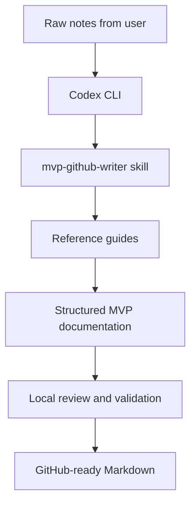
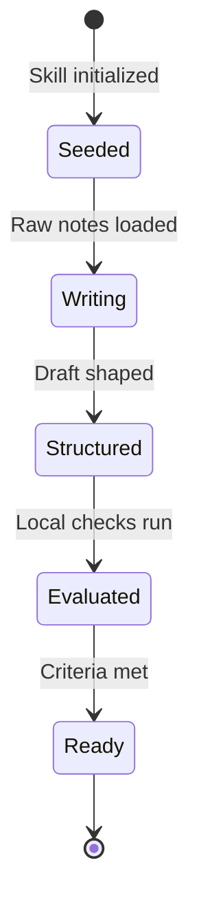

# mvp-github-writer

> A sovereign, local, and SkillOpt-optimized Codex CLI skill for generating pristine English GitHub MVP documentation.

Status note: This is a local skill laboratory. The seed skill, references, templates, eval cases, reports, and version snapshots are already in place and under iterative optimization.

## Table of Contents
- [Executive Summary](#executive-summary)
- [Problem](#problem)
- [Product Promise](#product-promise)
- [Core Principles](#core-principles)
- [Architecture](#architecture)
- [Repository Layout](#repository-layout)
- [Workflow](#workflow)
- [Technical Stack](#technical-stack)
- [Security and Governance](#security-and-governance)
- [Roadmap](#roadmap)
- [Acceptance Criteria](#acceptance-criteria)
- [Limitations](#limitations)
- [Final Verdict](#final-verdict)
- [Signature Sentence](#signature-sentence)

## Executive Summary
mvp-github-writer is a local Codex skill laboratory for producing high-quality GitHub-ready MVP documentation in English.

It exists to solve a specific operational failure: AI-generated repository docs are often vague, over-marketed, structurally weak, or disconnected from real engineering evidence. This lab replaces that pattern with a governed writing system built around local execution, repeatable structure, and audit-ready outputs.

The result is documentation that reads cleanly, links internally, states constraints plainly, and proves its own credibility through architecture, workflow, roadmap, and acceptance criteria.

## Problem
AI agents often produce repository documentation that fails in the same ways:
- It is too generic to be operationally useful.
- It depends on cloud services or hidden assumptions.
- It uses inflated marketing language instead of technical truth.
- It lacks architecture, testing gates, and traceable review steps.
- It exposes no clear standard for quality or governance.

This creates friction for maintainers, reviewers, and users. The repository may exist, but the documentation does not function as a trustworthy operating contract.

## Product Promise
This skill laboratory produces structured, credible, public-facing GitHub MVP documentation from raw notes.

It turns unshaped input into a document set that is:
- local-first;
- audit-friendly;
- Markdown-native;
- relative-link aware;
- concise enough to read quickly;
- strict enough to survive review.

What it does not do yet:
- it does not write marketing copy;
- it does not generate execution code;
- it does not rely on external cloud services for core functionality;
- it does not expose secrets, private paths, or hidden dependencies.

## Core Principles

| Principle | Meaning | Impact |
| :--- | :--- | :--- |
| **Local Authority** | All generation stays inside the Windows 11 local boundary. | No avoidable data leak path enters the workflow. |
| **Auditability** | Every meaningful step can be traced through local files and reports. | Reviewers can inspect what changed and why. |
| **Stylistic Concision** | The prose stays active, direct, and free of AI filler. | The output remains readable and credible. |
| **Human Review** | Durable decisions stay under human oversight. | The skill remains governed, not autonomous. |
| **Proof Over Flourish** | Documentation must show the mechanism, not just the promise. | Architecture, workflow, and acceptance criteria carry the weight. |

## Architecture
The system is simple by design.



The architecture follows a controlled sequence:
1. The user provides raw notes.
2. Codex CLI loads the skill.
3. The skill applies the writing method, brand rules, and Markdown standards.
4. SkillOpt refines the instructions through local evaluation.
5. The output is published as a document set with relative links and clear structure.

### Data and State Flow



The state machine is intentionally narrow. It reduces ambiguity and makes failure visible early.

## Repository Layout
```text
skills-lab/mvp-github-writer/
├── SKILL.md
├── best_skill.md
├── CHANGELOG.md
├── README.md
├── references/
│   ├── github-markdown-standards.md
│   ├── mvp-writing-method.md
│   ├── strategic-style.md
│   ├── vigilum-branding.md
│   └── governor-memory-reference-pattern.md
├── templates/
│   ├── ACCEPTANCE_CRITERIA.template.md
│   ├── ARCHITECTURE.template.md
│   ├── PRODUCT.template.md
│   ├── README.template.md
│   ├── ROADMAP.template.md
│   └── WIKI_HOME.template.md
├── evals/
│   ├── scoring-rubric.md
│   ├── cases/
│   └── expected/
├── reports/
└── versions/
    ├── v0.1_seed/
    ├── v0.2_skillopt_candidate/
    └── v1.0_stable/
```

The layout separates seed material, reusable references, test cases, reporting, and version snapshots. That separation keeps the lab inspectable and keeps rollback options visible.

## Workflow
The workflow is built to stay local and repeatable.
1. Collect raw notes.
2. Load mvp-github-writer.
3. Apply the writing method and brand rules.
4. Generate the document set in GitHub-flavored Markdown.
5. Validate structure, links, Mermaid syntax, and criteria.
6. Record the result in local reports.
7. Promote only the version that survives review.

The intended output is not a single page by default. It is a small documentation set that can include:
- `README.md`
- `docs/PRODUCT.md`
- `docs/ARCHITECTURE.md`
- `docs/ROADMAP.md`
- `docs/ACCEPTANCE_CRITERIA.md`

## Technical Stack
- Windows 11 Professionnel
- Codex CLI
- PowerShell 7+
- Git
- Markdown
- Mermaid
- SkillOpt evaluation workflow

The stack is intentionally small. The skill relies on local execution and repository-native files rather than a hosted documentation pipeline.

## Security and Governance
This lab follows a strict governance model.
- Human review stays in the loop for durable decisions.
- Local files remain the traceable source of truth.
- Private data stays private.
- Absolute paths should not appear in public-facing documentation.
- API keys, tokens, and credentials must never be embedded in outputs.
- Documentation quality is treated as an engineering control, not a cosmetic layer.
- Reports and versions provide forensic traceability for changes.

The operational rule is simple: if the document cannot be trusted, it is not ready.

## Roadmap

### Phase 0 - Specification
- Complete the master intervention plan.
- Fix the documentation standard.
- Confirm the required file set and review gates.

### Phase 1 - Local Laboratory
- Bootstrap the directory structure.
- Seed the skill, references, templates, and test cases.
- Keep the scope local and inspectable.

### Phase 2 - Technical Hardening
- Refine templates for Mermaid, criteria, and repo structure.
- Improve poor-draft rewrite cases.
- Tighten evaluation scoring and quality gates.

### Phase 3 - Deploy and Sync
- Copy the lab to the active skill deployment location.
- Run a clean targeted Git commit.
- Preserve the stable archive in versions/.

## Acceptance Criteria
- [x] The generated README is readable and understandable in under two minutes.
- [x] Mermaid flowcharts and state machines render cleanly on GitHub.
- [x] Relative links resolve inside the repository.
- [x] No absolute local paths appear in public-facing output.
- [x] No API keys, tokens, or private data are exposed.
- [x] The skill instructions remain within a compact context budget.
- [x] Proscribed AI clichés are removed from the final prose.
- [x] The document set includes architecture, workflow, roadmap, and acceptance criteria.
- [x] Local validation artifacts exist for the generated output.

## Limitations
This MVP is intentionally narrow.
- It writes technical English documentation only.
- It does not write marketing copy.
- It does not generate implementation code.
- It does not claim trust without showing the supporting structure.
- It does not replace human review.
- It does not depend on cloud-hosted documentation generation for its core operation.

These limits are a feature. They keep the system honest.

## Final Verdict
The laboratory is warm, armed, and ready for continuous optimization.

It does one job with discipline: it turns rough engineer notes into governed GitHub MVP documentation that can survive review.

## Signature Sentence
A README is not a cover page. It is the operating contract of the repository.
