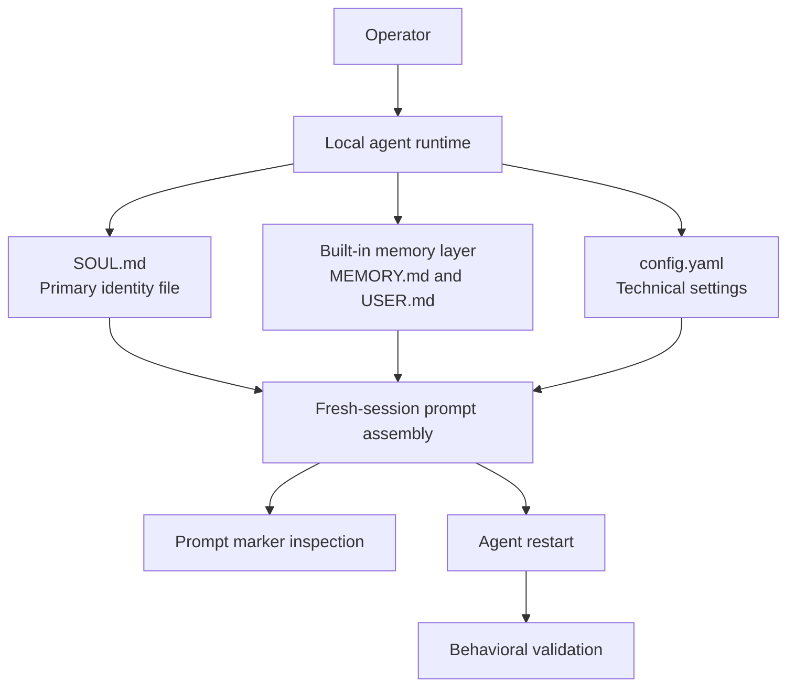

# Hermes SOUL

## A Minimal Viable Personality Layer for Local AI Agents

A local-first, audit-friendly personality layer that uses `SOUL.md` to shape agent identity, verify prompt inclusion, and validate behavior after restart.

## Status

Hermes SOUL is a documentation MVP, public case study, and operational specification. It is not an installable library, hosted product, universal framework, or replacement for the Hermes agent runtime.

## Table of Contents

- [Executive Summary](#executive-summary)
- [Problem](#problem)
- [Product Promise](#product-promise)
- [Core Principles](#core-principles)
- [Architecture](#architecture)
- [Repository Layout](#repository-layout)
- [Workflow](#workflow)
- [Technical Scope](#technical-scope)
- [Security and Governance](#security-and-governance)
- [Validation Strategy](#validation-strategy)
- [Roadmap](#roadmap)
- [Acceptance Criteria](#acceptance-criteria)
- [Limitations](#limitations)
- [Final Verdict](#final-verdict)
- [Signature Sentence](#signature-sentence)

## Executive Summary

Hermes SOUL documents a validated local-agent pattern: define personality in `SOUL.md`, verify that the adapted charter reaches the final prompt, then confirm behavior after restart.

The observed Hermes runtime already had an operational CLI, active persistent memory, a built-in memory provider, separate memory and user profile files, configuration, and a security guidance plugin. The missing piece was a formal personality layer that could survive audit and fresh-session validation.

The result is a conservative MVP: a reproducible identity-file method for local AI agents, not a global claim about every agent runtime.

## Problem

A local agent can be operational and still behave generically. Tools and memory do not automatically provide a stable role, tone, action doctrine, safety posture, or terminal protocol.

Hermes initially had a `personality` field under display settings. That field was not retained as the injection point. The code audit showed that `SOUL.md` was the primary identity file and replaced the default identity.

## Product Promise

Hermes SOUL gives operators a minimal way to make local-agent personality explicit, auditable, and restart-aware.

The method proves three things:

- the adapted charter exists in `SOUL.md`;
- the markers appear in the final system prompt for a fresh session;
- post-restart behavior aligns with the charter.

## Core Principles

- Treat AI as local infrastructure under operator control.
- Audit before changing identity or configuration.
- Do not inject doctrine into display-only settings.
- Adapt public doctrine to the agent; do not copy it raw.
- Verify at file level, prompt level, and behavior level.
- Keep private names, accounts, paths, secrets, and long logs out of public docs.
- State scope limits instead of overclaiming.

## Architecture



See [Architecture](docs/ARCHITECTURE.md) for the full flow and validation lifecycle.

## Repository Layout

```text
.
|-- README.md
|-- docs/
|   |-- PRODUCT.md
|   |-- ARCHITECTURE.md
|   |-- ROADMAP.md
|   |-- ACCEPTANCE_CRITERIA.md
|   |-- SECURITY.md
|   |-- VALIDATION.md
|   |-- TERMINAL_PROTOCOL.md
|   +-- CASE_STUDY_SCOPE.md
```

## Workflow

1. Audit memory, profile files, plugins, and configuration.
2. Identify `display.personality` as a false injection lead.
3. Confirm `SOUL.md` as the primary identity file through code audit.
4. Adapt the public personality charter for Hermes.
5. Copy the local charter into `SOUL.md`.
6. Verify marker strings in `SOUL.md`.
7. Inspect the final prompt offline.
8. Restart the agent.
9. Validate behavior against the charter.
10. Record the evidence without publishing raw private logs.

## Technical Scope

The observed setup used a local Ubuntu workstation, Hermes CLI, persistent built-in memory, separate memory and user profile files, `~/.hermes/config.yaml`, `~/.hermes/SOUL.md`, offline prompt inspection, and restart-aware behavioral validation.

The pattern can inform other local agents, but compatibility must be verified per runtime.

## Security and Governance

Hermes SOUL treats documentation quality as a governance control. The public repository must not expose private local data, full private paths, secrets, tokens, credentials, account names, or long raw logs.

Human validation remains required at critical boundaries: secrets, deletion, irreversible changes, payments, external accounts, cloud services, public release, legal decisions, security decisions, and ambiguous authority.

See [Security](docs/SECURITY.md).

## Validation Strategy

Validation succeeded at three levels:

- file-level: markers were present in `SOUL.md`;
- prompt-level: offline inspection found the same markers in the final system prompt for a fresh session;
- behavior-level: after restart, behavior aligned with the adapted charter.

See [Validation](docs/VALIDATION.md).

## Roadmap

The roadmap stays small: clarify terminology, document the identity-file pattern, harden validation and restart semantics, improve publication quality, and explore adapters only after each runtime is audited.

See [Roadmap](docs/ROADMAP.md).

## Acceptance Criteria

Acceptance criteria cover file-level validation, prompt-level validation, restart behavior, GitHub readability, privacy protection, relative links, scope boundaries, and Mermaid renderability.

See [Acceptance Criteria](docs/ACCEPTANCE_CRITERIA.md).

## Limitations

- Hermes SOUL is not an installable package.
- The observed mechanism is validated for the observed Hermes runtime only.
- Restart mattered in the observed workflow.
- Offline prompt inspection depends on local runtime internals.
- Built-in memory was observed, but this MVP does not generalize memory providers.

## Final Verdict

Hermes SOUL proves a narrow operational claim: a local agent personality layer is trustworthy only when it survives file inspection, prompt inspection, and post-restart behavior testing.

## Signature Sentence

A local AI agent should not only have tools and memory. It also needs a governed identity layer that defines its role, tone, action doctrine, safety boundaries, security discipline, memory behavior, and verification markers.
