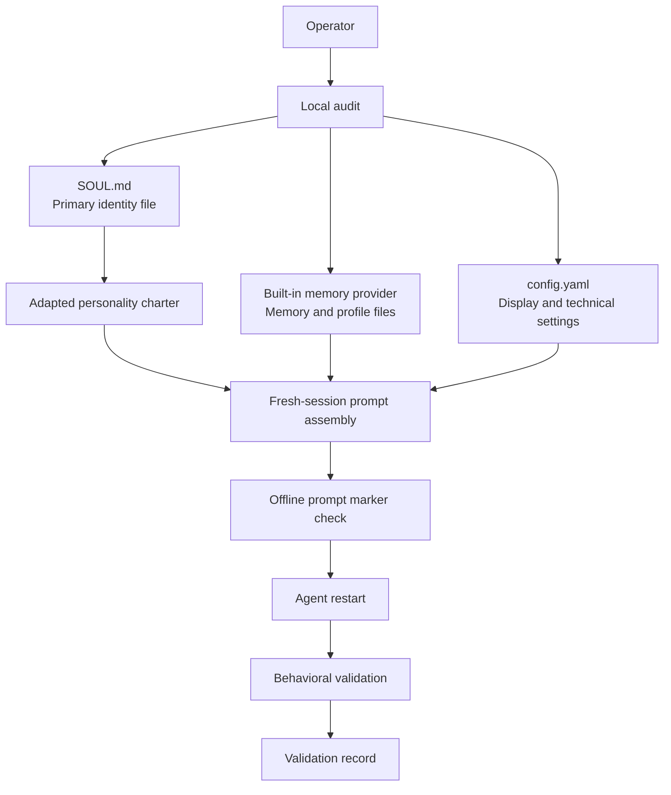
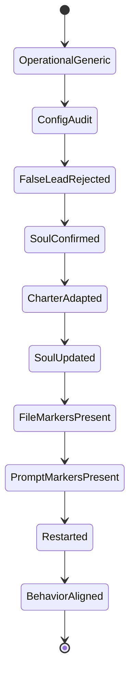

# Architecture

## Local Audit-Friendly Flow

Hermes SOUL models personality as a local identity layer. The observed runtime used `SOUL.md` as the primary identity source, built-in memory as continuity support, and offline prompt inspection as proof that identity markers reached the final system prompt.

## Component View



## Lifecycle View



## Identity Source

The observed code audit showed that `SOUL.md` is the primary identity file. It replaces the default identity and loads automatically.

This matters because a configuration field named `personality` appeared under display settings. That field was not retained as the injection point.

## Memory Scope

Persistent memory was active. The observed provider was built-in only. Separate memory and user profile files existed.

This MVP treats memory as a continuity layer, not as proof of identity injection. Identity proof comes from prompt markers and behavior after restart.

## Fresh-Session Prompt Construction

Fresh-session prompt construction matters because an active session can retain older context. In the observed workflow, offline prompt inspection confirmed that the adapted charter markers were present in the final system prompt for a fresh session.

## Validation Markers

Markers make inspection direct:

```text
HERMES_PERSONALITY_CHARTER_V0_1
HERMES_ACTION_FIRST
HERMES_TERMINAL_UBUNTU_PROTOCOL
HANDOFF_COMPLETE
```

The exact marker names are less important than the validation discipline: the same markers must appear in the identity file and in the final prompt.

## Why Restart Matters

An initial behavior test did not fully reflect the new personality. After restart, behavior aligned with the charter.

The documented scope is conservative: restart was required in the observed workflow for behavior to visibly align. Other runtimes may differ.

Signature sentence: the architecture is small because the evidence path is the product.
