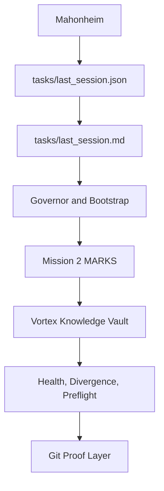

# CVSLB MVP

Build a governed local second brain for Codex work, with human authority, Git proof, structured Vortex knowledge, and repeatable health checks.

Vortex is the vault name folder Inside OBSIDIAN.

Status: MVP-ready internal documentation derived from the 2026-06-09 CVSLB audit report.

Source report: internal CVSLB audit report dated 2026-06-09.

Default license recommendation: MIT, unless Mahonheim chooses another license. This is not legal advice.

## Table of Contents

- [Quickstart](#quickstart)
- [Executive Summary](#executive-summary)
- [Problem](#problem)
- [Product Promise](#product-promise)
- [Core Principles](#core-principles)
- [Architecture](#architecture)
- [Repository Layout](#repository-layout)
- [Workflow](#workflow)
- [Technical Stack](#technical-stack)
- [Security and Governance](#security-and-governance)
- [Repository Health](#repository-health)
- [Documentation Quality Gates](#documentation-quality-gates)
- [Roadmap](#roadmap)
- [Acceptance Criteria](#acceptance-criteria)
- [Limitations](#limitations)
- [Final Verdict](#final-verdict)
- [Signature Sentence](#signature-sentence)

## Quickstart

1. Open the canonical workspace:

```powershell
cd <your-local-codex-workspace>
```

2. Read the mandatory Governor chain before substantive work:

```text
START_HERE.md
AGENTS.md
rules\MEMORY_GOVERNANCE.md
tasks\last_session.md
```

3. Run the local bootstrap:

```powershell
powershell -NoProfile -ExecutionPolicy Bypass -File .\tools\codex-session-bootstrap.ps1
```

4. Check Vortex health before consolidation or closure:

```powershell
python .\tools\vortex_health.py
python .\tools\vortex_divergence.py
python .\tools\vortex_preflight.py
```

5. Use Mission 2 markers during meaningful sessions:

```text
FOCUS:
CAPTURE:
SAVE:
PREPARE_CLOSURE:
END:
RULE:
ULTRA-Rapport
MVP+
```

## Executive Summary

CVSLB, short for Codex Vortex Second Living Brain, is a local governed memory system for Codex work on NUMENOR. It combines mandatory session bootstrap, canonical session handoff files, a structured Vortex knowledge vault, Mission 2 capture markers, health gates, divergence checks, preflight checks, and Git proof.

The audit source states that CVSLB has reached a serious internal MVP level. It can resume work, classify knowledge, link reports and decisions, verify its own graph, and keep Vortex non-sovereign. The system is designed to support Mahonheim, not replace Mahonheim.

The operational win is clear: Codex can work across sessions without relying on stale conversation memory, while every durable claim stays tied to local files, validation, and Git history.

## Problem

Long-running Codex work creates three recurring risks:

- project state can be rebuilt from stale memory instead of local truth;
- useful session knowledge can disappear into chat history;
- a knowledge vault can become impressive but non-authoritative, noisy, or hard to audit.

CVSLB addresses those risks by separating authority, capture, promotion, verification, and proof.

## Product Promise

CVSLB provides a local, governed second brain that lets Codex:

- resume from canonical session files;
- capture substantive work through Mission 2;
- promote only durable knowledge into Vortex;
- distinguish facts, drafts, decisions, reports, and open items;
- verify Vortex through local scripts;
- use Git as the proof layer;
- keep Mahonheim as final authority.

## Core Principles

1. Human authority comes first.
2. Local files override stale context.
3. `tasks/last_session.json` is the canonical reprise.
4. Vortex organizes knowledge but does not decide.
5. Git proves state, history, and rollback.
6. Durable decisions require explicit validation.
7. Capture can be broad, but promotion must be selective.
8. Health checks must be reproducible from local scripts.
9. No secrets, hooks, push, or external modification without explicit validation.
10. Documentation is proof of work, not decoration.

## Architecture

CVSLB uses layered authority and verification.



Authority order:

1. Mahonheim.
2. `tasks/last_session.json`.
3. `tasks/last_session.md`.
4. Governor and Memory Governor.
5. Git proof.
6. Vortex as organized non-sovereign knowledge.

## Repository Layout

Key paths:

```text
.
.
|-- START_HERE.md
|-- AGENTS.md
|-- rules/
|   `-- MEMORY_GOVERNANCE.md
|-- tasks/
|   |-- last_session.json
|   |-- last_session.md
|   |-- sessions_archive/
|   `-- sessions_index.jsonl
|-- tools/
|   |-- codex-session-bootstrap.ps1
|   |-- vortex_health.py
|   |-- vortex_divergence.py
|   `-- vortex_preflight.py
|-- Vortex/
|   |-- MARKS/
|   |-- 20_Concepts/
|   |-- 40_Summaries/
|   |-- 50_Decisions/
|   |-- 70_Projects/
|   |-- 80_Sessions/
|   `-- _metadata/
`-- Database/
    `-- Files/
        `-- MVP-Output/
```

## Workflow

Standard session flow:

1. Bootstrap from local files.
2. Read relevant canonical sources before project-state answers.
3. Use `FOCUS:` to declare the active subject.
4. Use `CAPTURE:` or automatic Mission 2 capture for substantive sessions.
5. Use `RULE:` only for durable rule changes, with validation.
6. Use `MVP+` when a named subject must become a GitHub-ready MVP deliverable.
7. Use `PREPARE_CLOSURE:` before closing a substantial session.
8. Use `END:` for final closure, verification, and handoff.
9. Use explicit-path Git staging only.

## Technical Stack

- Windows 11 local workspace.
- PowerShell 5.1 as default operational glue.
- Python for parsing, indexing, health checks, divergence checks, and preflight.
- Markdown as the durable documentation format.
- Git for proof, history, comparison, and rollback.
- Vortex as the structured knowledge vault.
- Codex skills for repeatable workflows.

No external cloud service is required for core CVSLB operation.

## Security and Governance

Security posture:

- do not read or expose credentials, tokens, auth files, caches, sessions, or secrets;
- do not use `git add .`;
- do not touch `LibrisMagna` unless explicitly asked;
- do not modify `<your-local-codex-config>` without explicit validation;
- do not install active hooks without explicit validation;
- do not promote decisions without explicit human validation.

Governance posture:

- Vortex is non-sovereign;
- generated reports are production outputs, not durable memory by themselves;
- sources are referenced, not silently rewritten;
- Git is the proof layer;
- Mahonheim remains final authority.

## Repository Health

The audit source reports:

- Vortex Health: OK.
- Health score: 100.
- Broken links: 0.
- Orphans: 0.
- Unpromoted sessions: 0.
- Unpromoted reports: 0.
- Unvalidated decisions: 0.
- Divergences: 0.
- Secret risk: 0.
- Preflight: OK.
- Git: clean at audit time.

Recommended local checks:

```powershell
python .\tools\vortex_health.py
python .\tools\vortex_divergence.py
python .\tools\vortex_preflight.py
git status --short --branch --untracked-files=all
```

## Documentation Quality Gates

Before publishing or promoting CVSLB documentation:

- confirm the document has a source path;
- confirm links are relative when possible;
- confirm decisions are not mixed with hypotheses;
- confirm open items are explicit;
- confirm no private data is exposed;
- confirm Markdown renders cleanly;
- confirm acceptance criteria are testable;
- confirm Vortex promotion is selective and useful;
- confirm Git status is classified before closure.

Optional GitHub-facing gates:

- Markdown linting;
- link checking;
- prose/style linting;
- dependency review if a repository contains dependencies;
- OpenSSF Scorecard for public repositories.

## Roadmap

Short term:

- review and validate the 2026-06-09 audit report;
- correct or supersede stale final acceptance checklist wording;
- promote a concise Vortex report fiche if validated;
- keep Git clean through explicit-path staging.

Medium term:

- promote the most important June 2026 sessions;
- add a qualitative useful-link audit;
- document the difference between strict canonical pages and total indexed pages;
- refine the cockpit when repeated human navigation paths appear.

Long term:

- make CVSLB the standard reprise and capitalization layer for major Codex work;
- keep Vortex non-sovereign;
- convert stable routines into skills;
- preserve human validation over apparent autonomy.

## Acceptance Criteria

CVSLB MVP is acceptable when:

- bootstrap reports `SESSION_BOOTSTRAP_DONE=1`;
- project-state answers are based on local canonical files;
- `tasks/last_session.json` remains the canonical reprise;
- Mission 2 markers are documented in `Vortex/MARKS`;
- substantive sessions leave exploitable capture or open items;
- durable decisions require explicit validation;
- Vortex health, divergence, and preflight checks can run locally;
- no broken links, orphaned canonical pages, or unvalidated decisions are reported by current gates;
- Git status is clean or explicitly classified;
- Vortex remains useful without becoming authoritative.

## Limitations

- CVSLB is an internal local system, not a hosted product.
- Current preflight checks are advisory unless Mahonheim validates active hooks.
- A perfect health score does not guarantee a useful graph; useful links still need human-oriented review.
- generated reports are not durable knowledge until promoted or linked appropriately.
- The number of promoted sessions is still low compared with the full workspace history.
- Licensing guidance defaults to MIT for MVP documentation, but it is not legal advice.

## Final Verdict

CVSLB is MVP-ready as a governed local second brain for Codex operations. It has the key properties required for serious use: authority order, reprise, capture, promotion, verification, and proof.

The next milestone is not more autonomy. The next milestone is higher daily utility: better promotion of significant sessions, clearer report summaries, and more human-useful navigation through Vortex.

## Signature Sentence

CVSLB is valuable because it lets Codex remember, verify, and resume work without taking authority away from Mahonheim.

