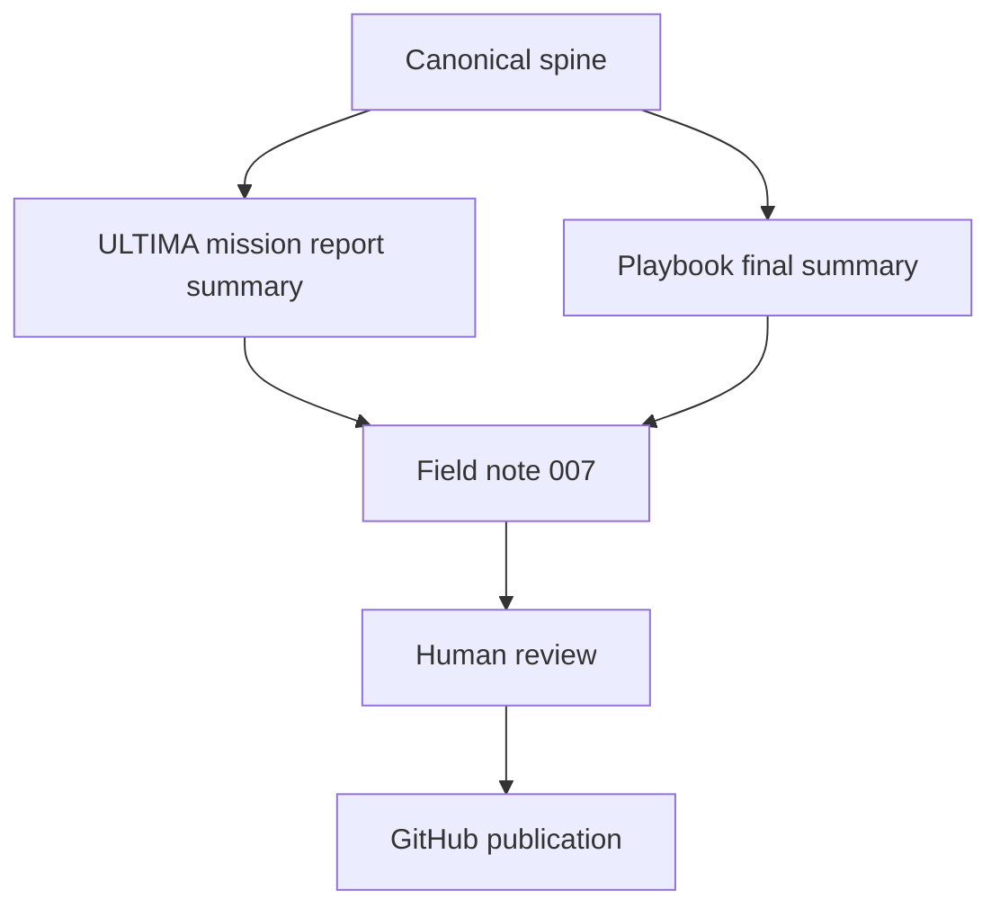

# 007 - Context Engineering for Codex CLI

Build a governed Codex CLI workspace that keeps one canonical spine,
explicit recovery, and human-validated durable decisions.

Status: refined for GitHub publication. This note is intentionally compact
and operational.

Companion syntheses:

- [ULTIMA Mission Report Summary](007-ultima-mission-report-summary.md)
- [Playbook Final Summary](007-playbook-final-summary.md)

## Table of Contents

- [Quickstart](#quickstart)
- [Supporting Documents](#supporting-documents)
- [Executive Summary](#executive-summary)
- [Problem](#problem)
- [Product Promise](#product-promise)
- [Core Principles](#core-principles)
- [Architecture](#architecture)
- [Repository Layout](#repository-layout)
- [Workflow](#workflow)
- [Technical Stack](#technical-stack)
- [Security and Governance](#security-and-governance)
- [Repository Health](#repository-health)
- [Documentation Quality Gates](#documentation-quality-gates)
- [Roadmap](#roadmap)
- [Acceptance Criteria](#acceptance-criteria)
- [Limitations](#limitations)
- [Final Verdict](#final-verdict)
- [Signature Sentence](#signature-sentence)

## Quickstart

1. Open the canonical workspace.
2. Read the recovery chain before making a durable judgment.
3. Run the local bootstrap and health checks.
4. Review the source reports, then publish only what is validated.

## Supporting Documents

- [ULTIMA Mission Report Summary](007-ultima-mission-report-summary.md)
- [Playbook Final Summary](007-playbook-final-summary.md)

## Executive Summary

This note describes a small operating model for long-running Codex CLI work.
The model keeps one canonical spine, produces reversible derived views, and
keeps human review in control of durable change.

It packages the validated path described by the ULTIMA mission report and
the final playbook into a compact GitHub-ready note.

The practical win is simple:

- recovery stays predictable;
- context stays explicit;
- published notes stay readable;
- Git remains the proof layer;
- Vortex remains a navigation layer, not a second authority.

## Problem

Long-running agent work gets fragile when the workspace depends on:

- stale conversation memory;
- ambiguous recovery paths;
- scattered derived notes;
- promotion without traceability;
- hidden authority layers;
- publication before validation.

This note addresses that failure mode by keeping the operating model small
and the evidence chain explicit.

## Product Promise

The repository promises a governed documentation pattern that:

- helps a maintainer recover state quickly;
- keeps operational context visible;
- makes publication reviewable;
- avoids hidden dependencies;
- preserves a clear path from source material to durable output.

## Core Principles

1. Canonical evidence comes first.
2. Human validation is required before durable change.
3. Derived views must remain disposable.
4. Git is the proof of record.
5. Local traceability matters more than presentation.
6. Simplicity beats ceremony.

## Architecture

The architecture stays intentionally small:

- one canonical spine;
- two source syntheses;
- one human authority for durable decisions;
- one published note derived from the validated material.

## Repository Layout

- `field-notes/`: numbered public notes.
- `README.md`: series index and entry point.
- `LICENSE`: repository license.
- `CONTRIBUTING.md`: contribution rules, if the repo needs them.
- `SECURITY.md`: disclosure guidance, if the repo is public.
- `CHANGELOG.md`: release history, if the series becomes iterative.

## Workflow

1. Validate the source material locally.
2. Draft the note in a compact GitHub-friendly form.
3. Remove private data, unsupported claims, and redundant narrative.
4. Check headings, links, and testable statements.
5. Publish only after explicit human validation.

## Technical Stack

- Markdown for durable documentation.
- Git for traceability and rollback.
- PowerShell for local orchestration on Windows.
- Python for optional checks, if needed.
- GitHub for publication and long-term access.

## Security and Governance

- No secrets, tokens, or credentials belong in the note.
- No external cloud service is required for the core workflow.
- Human review is required before durable publication.
- GitHub output must stay scoped to validated material only.
- MIT is the default license recommendation unless another license is chosen.

## Repository Health

Before publication, confirm:

- the note is the right size for the project;
- the summary matches the source reports;
- the structure is readable on GitHub;
- the note does not expose private data;
- the repository remains coherent after the change.

## Documentation Quality Gates

- Headings are complete and in order.
- Links are relative and resolve inside the repo.
- Claims are supported by local source material.
- Acceptance criteria are testable.
- Limitations are explicit.
- The note does not depend on an external service for its core value.

Optional CI gates:

- Markdown linting.
- Link checking.
- Prose/style linting.
- Dependency review for the repo around the note.
- OpenSSF Scorecard for public-facing maturity.

## Roadmap

1. Keep the note short enough to audit quickly.
2. Add companion governance notes only if they solve a real gap.
3. Expand the series only when a new note adds new operational value.
4. Prefer small updates over broad rewrites.

## Acceptance Criteria

- A reader can understand the operating model in under five minutes.
- The recovery chain is clear.
- The publication rules are explicit.
- The note contains no private data.
- The note can be reviewed on GitHub without extra context.

## Limitations

- This is governance documentation, not a self-running product.
- The model depends on local validation.
- The note does not replace repository-specific policy files.
- Public publication still requires human review.

## Final Verdict

This MVP is ready as a compact GitHub field note.

It is small enough to maintain, explicit enough to trust, and structured
enough to audit.

## Signature Sentence

Context Engineering for Codex CLI works when the canonical spine stays
singular and the final decision stays human.
